# Twitter-Clone Architecture Plan

> Stack: React 19 · Next.js 16 · Radix UI · Tailwind CSS 4 · D3.js · TanStack Query · React Context · Node.js 24 · Next.js Server Actions · Custom SDK · Catch-all Proxy · CopilotKit v2 · NextAuth 5 · Microsoft Entra ID · OAuth 2.0 · JWT · PostgreSQL 17/Aurora · Prisma 7 · Redis 7/ElastiCache · AWS (ECS · KMS · Secrets Manager · Aurora · ElastiCache) · Zod · Vitest 4 · MSW 2 · Playwright · ESLint 9 · Prettier · Stylelint · TypeScript strict

---

## Table of Contents

1. [System Architecture Overview](#1-system-architecture-overview)
2. [Frontend Architecture](#2-frontend-architecture)
3. [Backend Architecture](#3-backend-architecture)
4. [Authentication Flow](#4-authentication-flow)
5. [Data Layer & Database Schema](#5-data-layer--database-schema)
6. [Caching Strategy](#6-caching-strategy)
7. [Zod Validation — Frontend & Server](#7-zod-validation--frontend--server)
8. [Custom SDK & Catch-all Proxy](#8-custom-sdk--catch-all-proxy)
9. [CopilotKit v2 AI Integration](#9-copilotkit-v2-ai-integration)
10. [Design System](#10-design-system)
11. [Feed Architecture & Fan-out](#11-feed-architecture--fan-out)
12. [Real-time & Notifications](#12-real-time--notifications)
13. [D3.js Analytics Layer](#13-d3js-analytics-layer)
14. [Testing Strategy](#14-testing-strategy)
15. [AWS Cloud Infrastructure](#15-aws-cloud-infrastructure)
16. [Patterns Used](#16-patterns-used)
17. [Technology Tradeoffs & Alternatives](#17-technology-tradeoffs--alternatives)

---

## 1. System Architecture Overview

### High-Level Layered Architecture

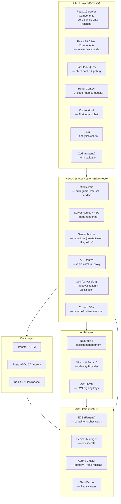
```mermaid
graph TB
    subgraph CLIENT["Client Layer (Browser)"]
        RSC["React 19 Server Components<br/>— zero-bundle data fetching"]
        RCC["React 19 Client Components<br/>— interactive islands"]
        TQ["TanStack Query<br/>— client cache + polling"]
        CTX["React Context<br/>— UI state (theme, modals)"]
        CK["CopilotKit v2<br/>— AI sidebar / chat"]
        D3["D3.js<br/>— analytics charts"]
        ZF["Zod (frontend)<br/>— form validation"]
    end

    subgraph NEXT["Next.js 16 App Router (Edge/Node)"]
        MW["Middleware<br/>— auth guard, rate-limit headers"]
        SR["Server Routes / RSC<br/>— page rendering"]
        SA["Server Actions<br/>— mutations (create tweet, like, follow)"]
        AP["API Routes<br/>— /api/* catch-all proxy"]
        ZS["Zod (server-side)<br/>— input validation + sanitisation"]
        SDK["Custom SDK<br/>— typed API client wrapper"]
    end

    subgraph AUTH["Auth Layer"]
        NA["NextAuth 5<br/>— session management"]
        ME["Microsoft Entra ID<br/>— Identity Provider"]
        KMS["AWS KMS<br/>— JWT signing keys"]
    end

    subgraph DATA["Data Layer"]
        PR["Prisma 7 ORM"]
        PG["PostgreSQL 17 / Aurora"]
        RD["Redis 7 / ElastiCache"]
    end

    subgraph AWS["AWS Infrastructure"]
        ECS["ECS (Fargate)<br/>— container orchestration"]
        SM["Secrets Manager<br/>— env secrets"]
        AL["Aurora Cluster<br/>— primary + read replicas"]
        EC["ElastiCache<br/>— Redis cluster"]
    end

    CLIENT --> NEXT
    NEXT --> AUTH
    NEXT --> DATA
    DATA --> AWS
    AUTH --> AWS
    NEXT --> AWS
```

---

### Request Lifecycle (end-to-end)

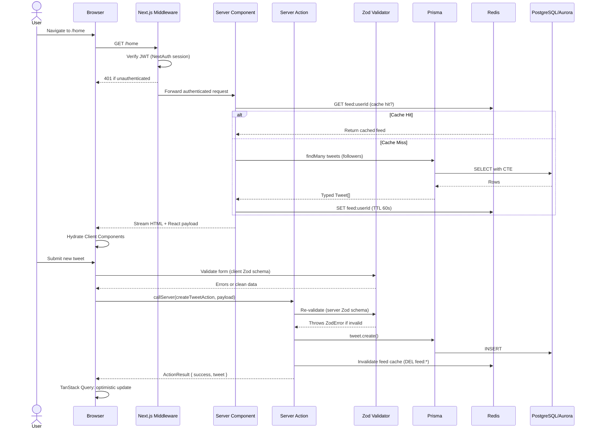
```mermaid
sequenceDiagram
    actor U as User
    participant B as Browser
    participant MW as Next.js Middleware
    participant RSC as Server Component
    participant SA as Server Action
    participant ZOD as Zod Validator
    participant PR as Prisma
    participant RD as Redis
    participant PG as PostgreSQL/Aurora

    U->>B: Navigate to /home
    B->>MW: GET /home
    MW->>MW: Verify JWT (NextAuth session)
    MW-->>B: 401 if unauthenticated
    MW->>RSC: Forward authenticated request
    RSC->>RD: GET feed:userId (cache hit?)
    alt Cache Hit
        RD-->>RSC: Return cached feed
    else Cache Miss
        RSC->>PR: findMany tweets (followers)
        PR->>PG: SELECT with CTE
        PG-->>PR: Rows
        PR-->>RSC: Typed Tweet[]
        RSC->>RD: SET feed:userId (TTL 60s)
    end
    RSC-->>B: Stream HTML + React payload
    B->>B: Hydrate Client Components
    U->>B: Submit new tweet
    B->>ZOD: Validate form (client Zod schema)
    ZOD-->>B: Errors or clean data
    B->>SA: callServer(createTweetAction, payload)
    SA->>ZOD: Re-validate (server Zod schema)
    ZOD-->>SA: Throws ZodError if invalid
    SA->>PR: tweet.create()
    PR->>PG: INSERT
    SA->>RD: Invalidate feed cache (DEL feed:*)
    SA-->>B: ActionResult { success, tweet }
    B->>B: TanStack Query: optimistic update
```

---

## 2. Frontend Architecture

### Component Hierarchy & Rendering Strategy

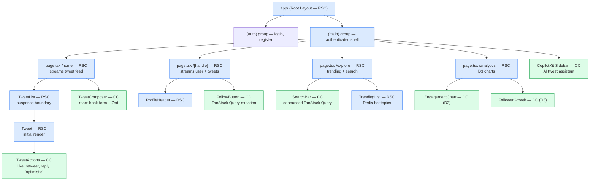
```mermaid
graph TD
    APP["app/ (Root Layout — RSC)"]
    APP --> AUTH_LAY["(auth) group — login, register"]
    APP --> MAIN_LAY["(main) group — authenticated shell"]

    MAIN_LAY --> HOME["page.tsx /home — RSC<br/>streams tweet feed"]
    MAIN_LAY --> PROFILE["page.tsx /[handle] — RSC<br/>streams user + tweets"]
    MAIN_LAY --> EXPLORE["page.tsx /explore — RSC<br/>trending + search"]
    MAIN_LAY --> ANALYTICS["page.tsx /analytics — RSC<br/>D3 charts"]

    HOME --> TL["TweetList — RSC<br/>suspense boundary"]
    HOME --> TL_CC["TweetComposer — CC<br/>react-hook-form + Zod"]
    TL --> TWEET["Tweet — RSC<br/>initial render"]
    TWEET --> ACTIONS["TweetActions — CC<br/>like, retweet, reply (optimistic)"]

    PROFILE --> PH["ProfileHeader — RSC"]
    PROFILE --> FBT["FollowButton — CC<br/>TanStack Query mutation"]

    EXPLORE --> SEARCH["SearchBar — CC<br/>debounced TanStack Query"]
    EXPLORE --> TREND["TrendingList — RSC<br/>Redis hot topics"]

    ANALYTICS --> CHART1["EngagementChart — CC (D3)"]
    ANALYTICS --> CHART2["FollowerGrowth — CC (D3)"]

    MAIN_LAY --> AI["CopilotKit Sidebar — CC<br/>AI tweet assistant"]

    classDef rsc fill:#dbeafe,stroke:#3b82f6
    classDef cc fill:#dcfce7,stroke:#16a34a
    class APP,MAIN_LAY,HOME,PROFILE,EXPLORE,ANALYTICS,TL,TWEET,PH,TREND rsc
    class TL_CC,ACTIONS,FBT,SEARCH,CHART1,CHART2,AI cc
```

### State Management Decision Tree

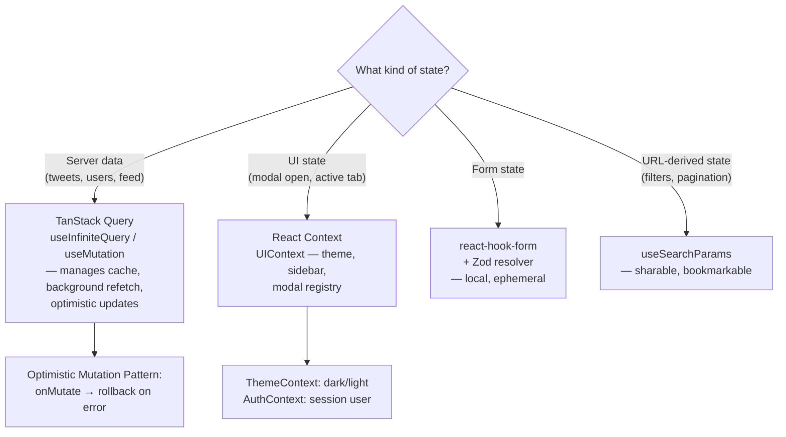
```mermaid
flowchart TD
    Q1{"What kind of state?"}
    Q1 -->|"Server data<br/>(tweets, users, feed)"| TQ["TanStack Query<br/>useInfiniteQuery / useMutation<br/>— manages cache, background refetch,<br/>optimistic updates"]
    Q1 -->|"UI state<br/>(modal open, active tab)"| CTX["React Context<br/>UIContext — theme, sidebar,<br/>modal registry"]
    Q1 -->|"Form state"| RHF["react-hook-form<br/>+ Zod resolver<br/>— local, ephemeral"]
    Q1 -->|"URL-derived state<br/>(filters, pagination)"| URL["useSearchParams<br/>— sharable, bookmarkable"]

    TQ --> OPT["Optimistic Mutation Pattern:<br/>onMutate → rollback on error"]
    CTX --> DARK["ThemeContext: dark/light<br/>AuthContext: session user"]
```

### TanStack Query Data Flow

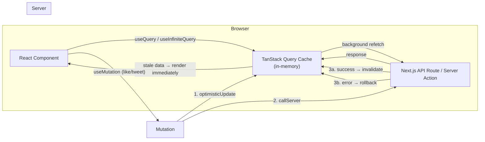
```mermaid
flowchart LR
    subgraph Browser
        COMP["React Component"]
        CACHE["TanStack Query Cache<br/>(in-memory)"]
        COMP -->|"useQuery / useInfiniteQuery"| CACHE
        CACHE -->|"stale data → render immediately"| COMP
        CACHE -->|"background refetch"| API
    end

    subgraph Server
        API["Next.js API Route / Server Action"]
        API -->|"response"| CACHE
    end

    COMP -->|"useMutation (like/tweet)"| MUT["Mutation"]
    MUT -->|"1. optimisticUpdate"| CACHE
    MUT -->|"2. callServer"| API
    API -->|"3a. success → invalidate"| CACHE
    API -->|"3b. error → rollback"| CACHE
```

---

## 3. Backend Architecture

### Next.js 16 App Router — Server Layers

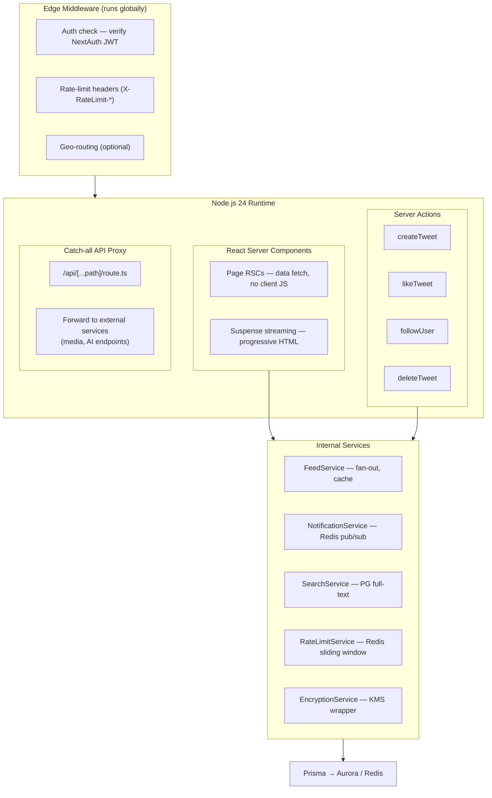
```mermaid
graph TD
    subgraph EDGE["Edge Middleware (runs globally)"]
        M1["Auth check — verify NextAuth JWT"]
        M2["Rate-limit headers (X-RateLimit-*)"]
        M3["Geo-routing (optional)"]
    end

    subgraph NODE["Node.js 24 Runtime"]
        subgraph RSC2["React Server Components"]
            R1["Page RSCs — data fetch, no client JS"]
            R2["Suspense streaming — progressive HTML"]
        end

        subgraph SA2["Server Actions"]
            A1["createTweet"]
            A2["likeTweet"]
            A3["followUser"]
            A4["deleteTweet"]
        end

        subgraph PROXY["Catch-all API Proxy"]
            P1["/api/[...path]/route.ts"]
            P2["Forward to external services<br/>(media, AI endpoints)"]
        end
    end

    subgraph SERVICES["Internal Services"]
        SVC1["FeedService — fan-out, cache"]
        SVC2["NotificationService — Redis pub/sub"]
        SVC3["SearchService — PG full-text"]
        SVC4["RateLimitService — Redis sliding window"]
        SVC5["EncryptionService — KMS wrapper"]
    end

    EDGE --> NODE
    RSC2 --> SERVICES
    SA2 --> SERVICES
    SERVICES --> DATA2["Prisma → Aurora / Redis"]
```

### Server Action Lifecycle with Zod

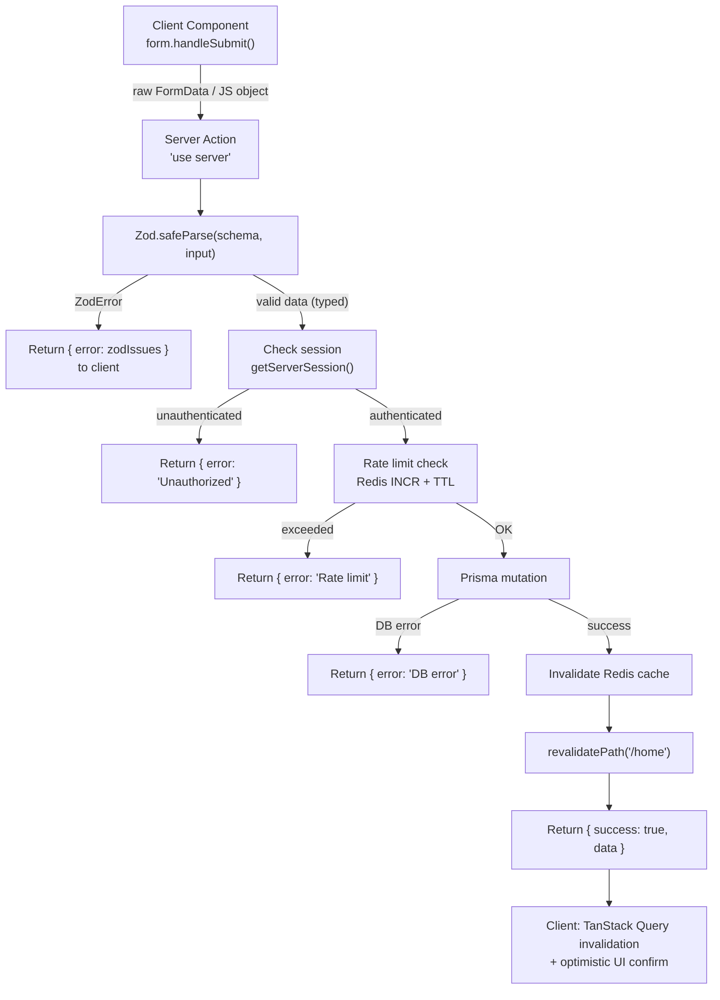
```mermaid
flowchart TD
    CC["Client Component<br/>form.handleSubmit()"]
    CC -->|"raw FormData / JS object"| SA["Server Action<br/>'use server'"]
    SA --> ZOD["Zod.safeParse(schema, input)"]
    ZOD -->|"ZodError"| ERR["Return { error: zodIssues }<br/>to client"]
    ZOD -->|"valid data (typed)"| AUTH_CHECK["Check session<br/>getServerSession()"]
    AUTH_CHECK -->|"unauthenticated"| UNAUTH["Return { error: 'Unauthorized' }"]
    AUTH_CHECK -->|"authenticated"| RL["Rate limit check<br/>Redis INCR + TTL"]
    RL -->|"exceeded"| RATE["Return { error: 'Rate limit' }"]
    RL -->|"OK"| PRISMA["Prisma mutation"]
    PRISMA -->|"DB error"| DBERR["Return { error: 'DB error' }"]
    PRISMA -->|"success"| CACHE["Invalidate Redis cache"]
    CACHE --> REVALIDATE["revalidatePath('/home')"]
    REVALIDATE --> SUCCESS["Return { success: true, data }"]
    SUCCESS --> CLIENT["Client: TanStack Query invalidation<br/>+ optimistic UI confirm"]
```

---

## 4. Authentication Flow

### NextAuth 5 + Microsoft Entra ID + JWT + KMS

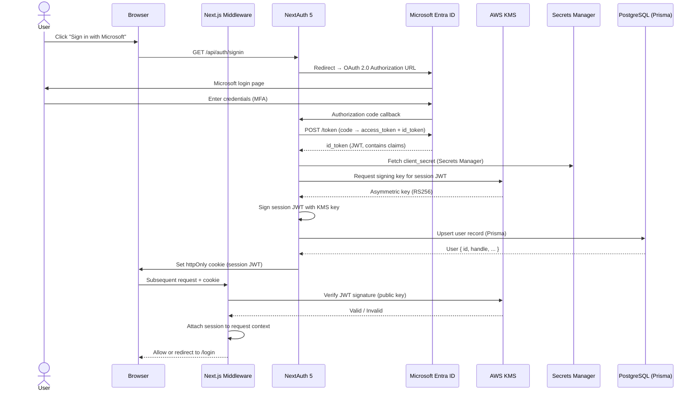
```mermaid
sequenceDiagram
    actor U as User
    participant B as Browser
    participant MW as Next.js Middleware
    participant NA as NextAuth 5
    participant ME as Microsoft Entra ID
    participant KMS as AWS KMS
    participant SM as Secrets Manager
    participant DB as PostgreSQL (Prisma)

    U->>B: Click "Sign in with Microsoft"
    B->>NA: GET /api/auth/signin
    NA->>ME: Redirect → OAuth 2.0 Authorization URL
    ME->>U: Microsoft login page
    U->>ME: Enter credentials (MFA)
    ME->>NA: Authorization code callback
    NA->>ME: POST /token (code → access_token + id_token)
    ME-->>NA: id_token (JWT, contains claims)
    NA->>SM: Fetch client_secret (Secrets Manager)
    NA->>KMS: Request signing key for session JWT
    KMS-->>NA: Asymmetric key (RS256)
    NA->>NA: Sign session JWT with KMS key
    NA->>DB: Upsert user record (Prisma)
    DB-->>NA: User { id, handle, ... }
    NA->>B: Set httpOnly cookie (session JWT)
    B->>MW: Subsequent request + cookie
    MW->>KMS: Verify JWT signature (public key)
    KMS-->>MW: Valid / Invalid
    MW->>MW: Attach session to request context
    MW-->>B: Allow or redirect to /login
```

### Auth State Machine

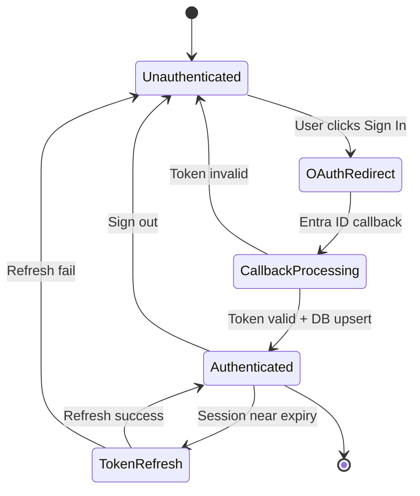
```mermaid
stateDiagram-v2
    [*] --> Unauthenticated
    Unauthenticated --> OAuthRedirect : User clicks Sign In
    OAuthRedirect --> CallbackProcessing : Entra ID callback
    CallbackProcessing --> Authenticated : Token valid + DB upsert
    CallbackProcessing --> Unauthenticated : Token invalid
    Authenticated --> TokenRefresh : Session near expiry
    TokenRefresh --> Authenticated : Refresh success
    TokenRefresh --> Unauthenticated : Refresh fail
    Authenticated --> Unauthenticated : Sign out
    Authenticated --> [*]
```

---

## 5. Data Layer & Database Schema

### Prisma 7 Schema (Entity Relationship)

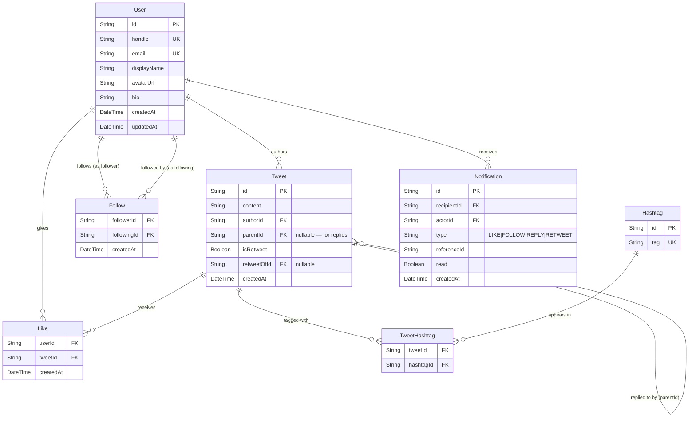
```mermaid
erDiagram
    User {
        String id PK
        String handle UK
        String email UK
        String displayName
        String avatarUrl
        String bio
        DateTime createdAt
        DateTime updatedAt
    }

    Tweet {
        String id PK
        String content
        String authorId FK
        String parentId FK "nullable — for replies"
        Boolean isRetweet
        String retweetOfId FK "nullable"
        DateTime createdAt
    }

    Like {
        String userId FK
        String tweetId FK
        DateTime createdAt
    }

    Follow {
        String followerId FK
        String followingId FK
        DateTime createdAt
    }

    Hashtag {
        String id PK
        String tag UK
    }

    TweetHashtag {
        String tweetId FK
        String hashtagId FK
    }

    Notification {
        String id PK
        String recipientId FK
        String actorId FK
        String type "LIKE|FOLLOW|REPLY|RETWEET"
        String referenceId
        Boolean read
        DateTime createdAt
    }

    User ||--o{ Tweet : "authors"
    User ||--o{ Like : "gives"
    Tweet ||--o{ Like : "receives"
    User ||--o{ Follow : "follows (as follower)"
    User ||--o{ Follow : "followed by (as following)"
    Tweet ||--o{ Tweet : "replied to by (parentId)"
    Tweet ||--o{ TweetHashtag : "tagged with"
    Hashtag ||--o{ TweetHashtag : "appears in"
    User ||--o{ Notification : "receives"
```

### Database Query Patterns

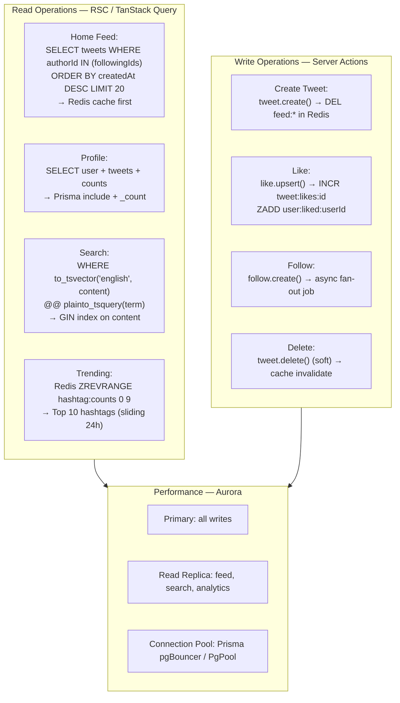
```mermaid
flowchart TD
    subgraph READ["Read Operations — RSC / TanStack Query"]
        R1["Home Feed:<br/>SELECT tweets WHERE authorId IN (followingIds)<br/>ORDER BY createdAt DESC LIMIT 20<br/>→ Redis cache first"]
        R2["Profile:<br/>SELECT user + tweets + counts<br/>→ Prisma include + _count"]
        R3["Search:<br/>WHERE to_tsvector('english', content)<br/>@@ plainto_tsquery(term)<br/>→ GIN index on content"]
        R4["Trending:<br/>Redis ZREVRANGE hashtag:counts 0 9<br/>→ Top 10 hashtags (sliding 24h)"]
    end

    subgraph WRITE["Write Operations — Server Actions"]
        W1["Create Tweet:<br/>tweet.create() → DEL feed:* in Redis"]
        W2["Like:<br/>like.upsert() → INCR tweet:likes:id<br/>ZADD user:liked:userId"]
        W3["Follow:<br/>follow.create() → async fan-out job"]
        W4["Delete:<br/>tweet.delete() (soft) → cache invalidate"]
    end

    subgraph PERF["Performance — Aurora"]
        P1["Primary: all writes"]
        P2["Read Replica: feed, search, analytics"]
        P3["Connection Pool: Prisma pgBouncer / PgPool"]
    end

    READ --> PERF
    WRITE --> PERF
```

---

## 6. Caching Strategy

### Multi-Layer Cache Architecture

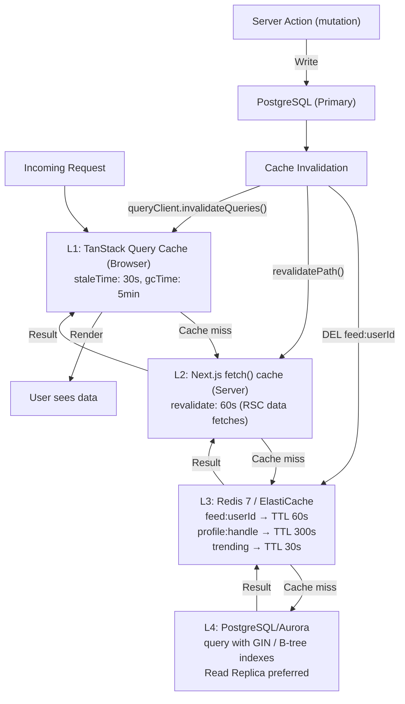
```mermaid
flowchart TD
    REQ["Incoming Request"]
    REQ --> L1["L1: TanStack Query Cache (Browser)<br/>staleTime: 30s, gcTime: 5min"]
    L1 -->|"Cache miss"| L2["L2: Next.js fetch() cache (Server)<br/>revalidate: 60s (RSC data fetches)"]
    L2 -->|"Cache miss"| L3["L3: Redis 7 / ElastiCache<br/>feed:userId → TTL 60s<br/>profile:handle → TTL 300s<br/>trending → TTL 30s"]
    L3 -->|"Cache miss"| L4["L4: PostgreSQL/Aurora<br/>query with GIN / B-tree indexes<br/>Read Replica preferred"]
    L4 -->|"Result"| L3
    L3 -->|"Result"| L2
    L2 -->|"Result"| L1
    L1 -->|"Render"| USER["User sees data"]

    WRITE["Server Action (mutation)"]
    WRITE -->|"Write"| PG2["PostgreSQL (Primary)"]
    PG2 --> INV["Cache Invalidation"]
    INV -->|"DEL feed:userId"| L3
    INV -->|"revalidatePath()"| L2
    INV -->|"queryClient.invalidateQueries()"| L1
```

### Redis Key Design

```mermaid
mindmap
  root((Redis Keys))
    feed
      feed:userId → JSON Tweet[]
      TTL: 60s
    tweet
      tweet:likes:tweetId → Integer
      tweet:retweets:tweetId → Integer
    user
      user:session:sessionId → JSON
      user:rateLimit:userId:action → Integer
      user:following:userId → Set of userIds
    trending
      hashtag:counts → Sorted Set (score = count)
      TTL: 30s
    notifications
      notif:unread:userId → Integer (count)
    pubsub
      channel:notifications:userId
      channel:feed:updates
```

### Redis Rate Limiting (Sliding Window)

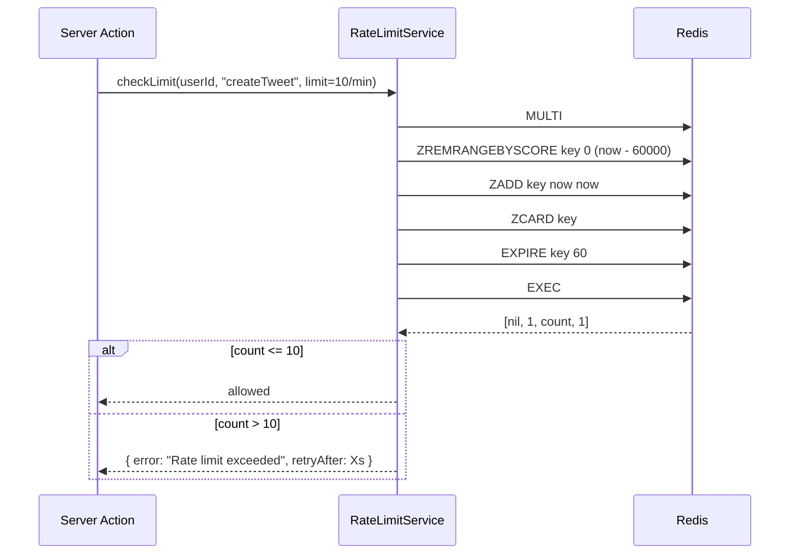
```mermaid
sequenceDiagram
    participant SA as Server Action
    participant RL as RateLimitService
    participant RD as Redis

    SA->>RL: checkLimit(userId, "createTweet", limit=10/min)
    RL->>RD: MULTI
    RL->>RD: ZREMRANGEBYSCORE key 0 (now - 60000)
    RL->>RD: ZADD key now now
    RL->>RD: ZCARD key
    RL->>RD: EXPIRE key 60
    RL->>RD: EXEC
    RD-->>RL: [nil, 1, count, 1]
    alt count <= 10
        RL-->>SA: allowed
    else count > 10
        RL-->>SA: { error: "Rate limit exceeded", retryAfter: Xs }
    end
```

---

## 7. Zod Validation — Frontend & Server

### Dual-Layer Validation Philosophy

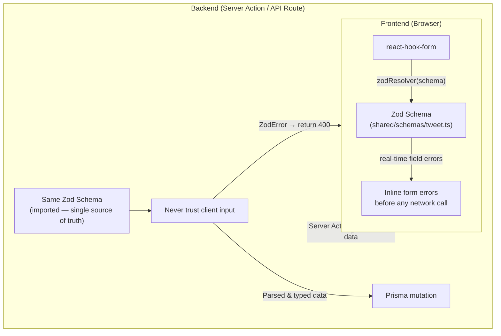
```mermaid
flowchart LR
    subgraph FE["Frontend (Browser)"]
        FORM["react-hook-form"]
        ZF2["Zod Schema<br/>(shared/schemas/tweet.ts)"]
        FORM -->|"zodResolver(schema)"| ZF2
        ZF2 -->|"real-time field errors"| UX["Inline form errors<br/>before any network call"]
    end

    subgraph BE["Backend (Server Action / API Route)"]
        ZS2["Same Zod Schema<br/>(imported — single source of truth)"]
        TRUST["Never trust client input"]
        ZS2 --> TRUST
        TRUST -->|"ZodError → return 400"| FE
        TRUST -->|"Parsed & typed data"| DB["Prisma mutation"]
    end

    FE -->|"Server Action call with raw data"| BE
```

### Shared Zod Schema Architecture

```
src/
└── shared/
    └── schemas/
        ├── tweet.schema.ts        ← createTweet, updateTweet
        ├── user.schema.ts         ← updateProfile, register
        ├── auth.schema.ts         ← sign-in fields
        ├── search.schema.ts       ← search query params
        └── index.ts               ← barrel export
```

### Example Schema Flow — Create Tweet

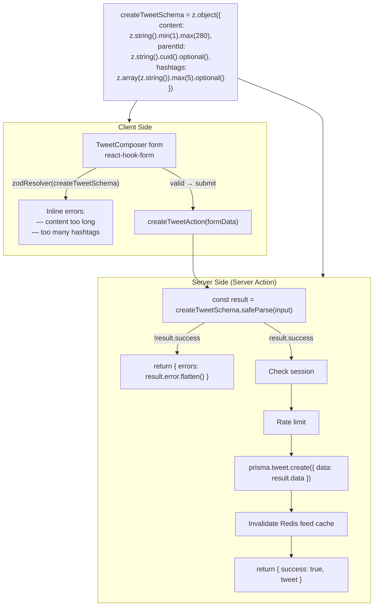
```mermaid
flowchart TD
    SCHEMA["createTweetSchema = z.object({<br/>  content: z.string().min(1).max(280),<br/>  parentId: z.string().cuid().optional(),<br/>  hashtags: z.array(z.string()).max(5).optional()<br/>})"]

    subgraph CLIENT_FLOW["Client Side"]
        FORM2["TweetComposer form<br/>react-hook-form"]
        FORM2 -->|"zodResolver(createTweetSchema)"| INLINE["Inline errors:<br/>— content too long<br/>— too many hashtags"]
        FORM2 -->|"valid → submit"| ACTION["createTweetAction(formData)"]
    end

    subgraph SERVER_FLOW["Server Side (Server Action)"]
        ACTION --> PARSE["const result = createTweetSchema.safeParse(input)"]
        PARSE -->|"!result.success"| RETURN_ERR["return { errors: result.error.flatten() }"]
        PARSE -->|"result.success"| SESSION2["Check session"]
        SESSION2 --> RL2["Rate limit"]
        RL2 --> PRISMA2["prisma.tweet.create({ data: result.data })"]
        PRISMA2 --> CACHE_INV["Invalidate Redis feed cache"]
        CACHE_INV --> RETURN_OK["return { success: true, tweet }"]
    end

    SCHEMA --> CLIENT_FLOW
    SCHEMA --> SERVER_FLOW
```

### Zod on API Routes (Catch-all Proxy)

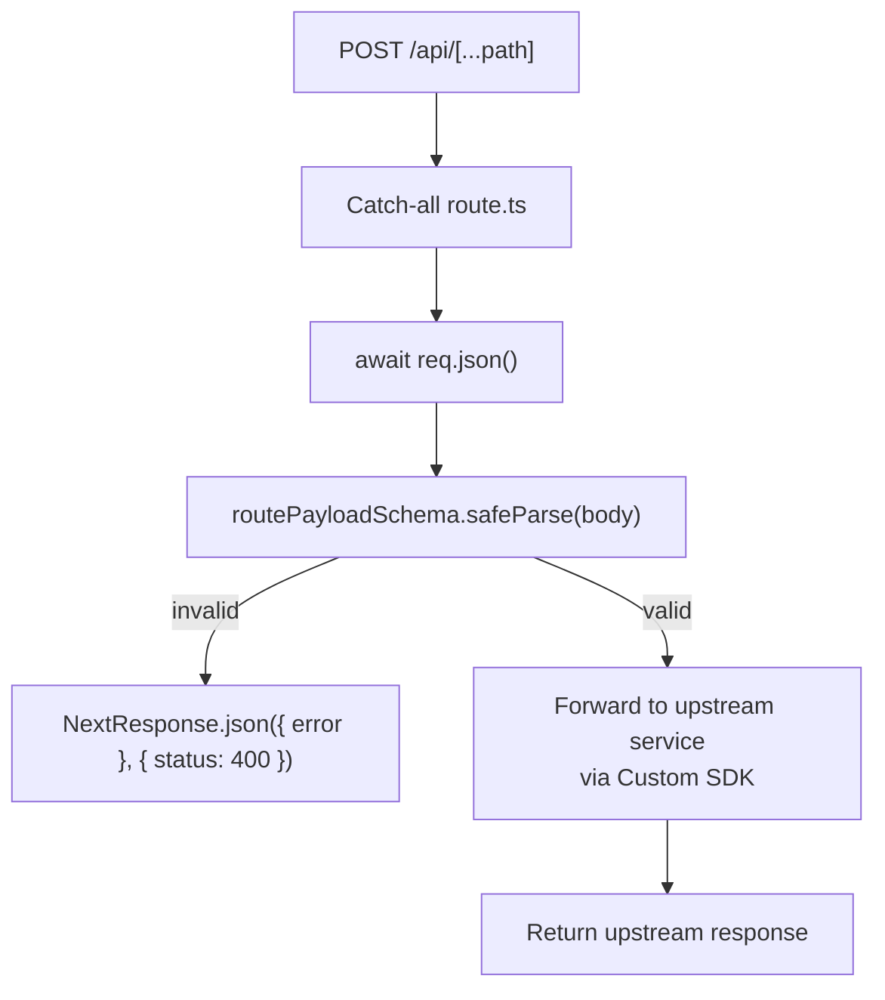
```mermaid
flowchart TD
    REQ2["POST /api/[...path]"]
    REQ2 --> PROXY["Catch-all route.ts"]
    PROXY --> PARSE_BODY["await req.json()"]
    PARSE_BODY --> ZOD_ROUTE["routePayloadSchema.safeParse(body)"]
    ZOD_ROUTE -->|"invalid"| R400["NextResponse.json({ error }, { status: 400 })"]
    ZOD_ROUTE -->|"valid"| FWD["Forward to upstream service<br/>via Custom SDK"]
    FWD --> RESP["Return upstream response"]
```

---

## 8. Custom SDK & Catch-all Proxy

### SDK Architecture

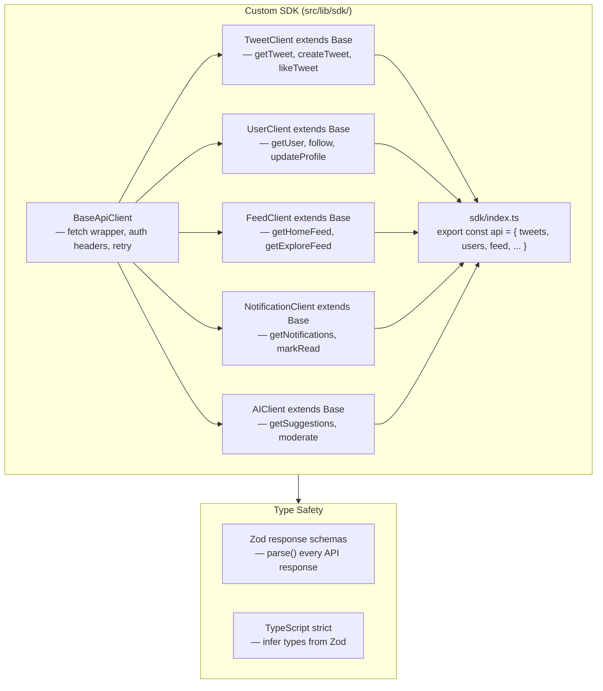
```mermaid
graph TD
    subgraph SDK["Custom SDK (src/lib/sdk/)"]
        BASE["BaseApiClient<br/>— fetch wrapper, auth headers, retry"]
        TW["TweetClient extends Base<br/>— getTweet, createTweet, likeTweet"]
        US["UserClient extends Base<br/>— getUser, follow, updateProfile"]
        FD["FeedClient extends Base<br/>— getHomeFeed, getExploreFeed"]
        NO["NotificationClient extends Base<br/>— getNotifications, markRead"]
        AI["AIClient extends Base<br/>— getSuggestions, moderate"]
        IDX["sdk/index.ts<br/>export const api = { tweets, users, feed, ... }"]
    end

    subgraph TYPES["Type Safety"]
        ZR["Zod response schemas<br/>— parse() every API response"]
        TS["TypeScript strict<br/>— infer types from Zod"]
    end

    BASE --> TW
    BASE --> US
    BASE --> FD
    BASE --> NO
    BASE --> AI
    TW --> IDX
    US --> IDX
    FD --> IDX
    NO --> IDX
    AI --> IDX
    SDK --> TYPES
```

### Catch-all Proxy Flow

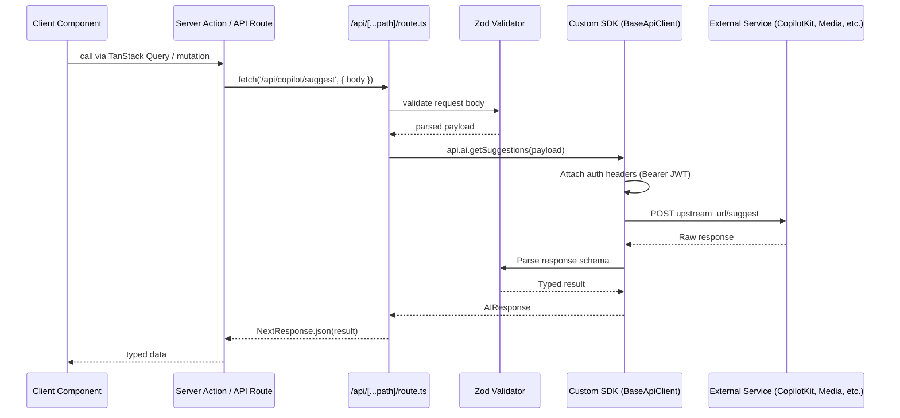
```mermaid
sequenceDiagram
    participant CC2 as Client Component
    participant SA3 as Server Action / API Route
    participant PROXY2 as /api/[...path]/route.ts
    participant ZOD3 as Zod Validator
    participant SDK2 as Custom SDK (BaseApiClient)
    participant EXT as External Service (CopilotKit, Media, etc.)

    CC2->>SA3: call via TanStack Query / mutation
    SA3->>PROXY2: fetch('/api/copilot/suggest', { body })
    PROXY2->>ZOD3: validate request body
    ZOD3-->>PROXY2: parsed payload
    PROXY2->>SDK2: api.ai.getSuggestions(payload)
    SDK2->>SDK2: Attach auth headers (Bearer JWT)
    SDK2->>EXT: POST upstream_url/suggest
    EXT-->>SDK2: Raw response
    SDK2->>ZOD3: Parse response schema
    ZOD3-->>SDK2: Typed result
    SDK2-->>PROXY2: AIResponse
    PROXY2-->>SA3: NextResponse.json(result)
    SA3-->>CC2: typed data
```

---

## 9. CopilotKit v2 AI Integration

### AI Feature Architecture

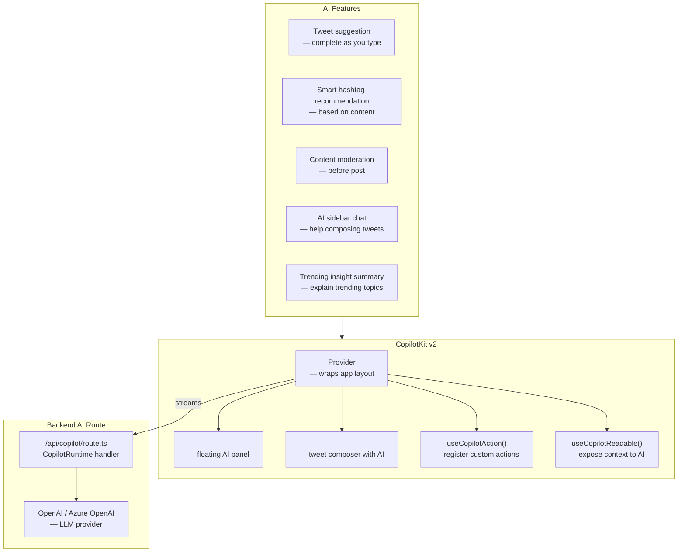
```mermaid
graph TD
    subgraph AI_FEATURES["AI Features"]
        F1["Tweet suggestion<br/>— complete as you type"]
        F2["Smart hashtag recommendation<br/>— based on content"]
        F3["Content moderation<br/>— before post"]
        F4["AI sidebar chat<br/>— help composing tweets"]
        F5["Trending insight summary<br/>— explain trending topics"]
    end

    subgraph COPILOTKIT["CopilotKit v2"]
        CK_PROV["<CopilotKit> Provider<br/>— wraps app layout"]
        CK_SIDE["<CopilotSidebar><br/>— floating AI panel"]
        CK_TEXT["<CopilotTextarea><br/>— tweet composer with AI"]
        CK_ACTION["useCopilotAction()<br/>— register custom actions"]
        CK_READ["useCopilotReadable()<br/>— expose context to AI"]
    end

    subgraph BACKEND_AI["Backend AI Route"]
        AI_ROUTE["/api/copilot/route.ts<br/>— CopilotRuntime handler"]
        AI_PROVIDER["OpenAI / Azure OpenAI<br/>— LLM provider"]
    end

    CK_PROV --> CK_SIDE
    CK_PROV --> CK_TEXT
    CK_PROV --> CK_ACTION
    CK_PROV --> CK_READ
    CK_PROV -->|"streams"| AI_ROUTE
    AI_ROUTE --> AI_PROVIDER
    AI_FEATURES --> COPILOTKIT
```

### CopilotKit Data Flow

```mermaid
sequenceDiagram
    participant U2 as User
    participant CT as CopilotTextarea
    participant CP as CopilotKit Runtime
    participant PR2 as /api/copilot
    participant LLM as Azure OpenAI (GPT-4o)
    participant SA4 as Server Action

    U2->>CT: Types "Excited about the new..."
    CT->>CP: Trigger suggestion (debounced 300ms)
    CP->>PR2: POST /api/copilot { messages, context }
    Note over CP,PR2: context includes: recent tweets,<br/>user's writing style, trending topics
    PR2->>LLM: Chat completion (streaming)
    LLM-->>PR2: Token stream
    PR2-->>CT: SSE stream
    CT-->>U2: Inline ghost text suggestion
    U2->>CT: Accept suggestion (Tab)
    CT->>CT: Full tweet content populated
    U2->>CT: Submit tweet
    CT->>SA4: createTweetAction(content)
```

---

## 10. Design System

### Component Architecture (Radix UI + Tailwind CSS 4)

```mermaid
graph TD
    subgraph PRIMITIVES["Layer 1 — Radix UI Primitives (unstyled, accessible)"]
        P1["Dialog, Sheet, Popover"]
        P2["DropdownMenu, ContextMenu"]
        P3["Avatar, Separator"]
        P4["Tooltip, HoverCard"]
        P5["Switch, Checkbox, RadioGroup"]
        P6["ScrollArea, Tabs"]
    end

    subgraph TOKENS["Layer 2 — Design Tokens (Tailwind CSS 4 @theme)"]
        T1["Colors: --color-brand-* (blue palette)"]
        T2["Typography: --font-sans, --font-mono"]
        T3["Spacing: 4px base grid"]
        T4["Radius: --radius-sm/md/lg/full"]
        T5["Shadows: --shadow-tweet-card"]
        T6["Dark mode: .dark variant"]
    end

    subgraph COMPOSED["Layer 3 — Composed Components"]
        C1["TweetCard — Avatar + content + actions"]
        C2["UserCard — Avatar + handle + bio + follow button"]
        C3["TrendingItem — hashtag + count badge"]
        C4["NotificationItem — icon + text + timestamp"]
        C5["SearchInput — Radix + icon + clear button"]
    end

    subgraph PAGES["Layer 4 — Page-level Compositions"]
        PG1["HomeFeed — TweetCard list + TweetComposer"]
        PG2["ProfilePage — header + pinned + feed tabs"]
        PG3["ExplorePage — search + trending + suggestions"]
    end

    PRIMITIVES --> COMPOSED
    TOKENS --> COMPOSED
    COMPOSED --> PAGES
```

### Tailwind CSS 4 Theme Setup

```mermaid
flowchart LR
    subgraph TAILWIND4["Tailwind CSS 4 — CSS-first config"]
        THEME["globals.css<br/>@import 'tailwindcss';<br/>@theme { --color-brand-500: #1d9bf0; }"]
        DARK["Dark mode via .dark class<br/>@theme dark { --color-bg: #000; }"]
        COMP["@layer components {<br/>  .tweet-card { @apply ... }<br/>}"]
    end

    subgraph RADIX_STYLE["Radix Styling"]
        DATA["data-[state=open]:...<br/>data-[disabled]:...<br/>data-[highlighted]:..."]
        ANIM["@keyframes via Tailwind<br/>animate-in, animate-out"]
    end

    THEME --> DARK
    DARK --> COMP
    RADIX_STYLE --> COMP
```

### Design Token Map

```mermaid
mindmap
  root((Design Tokens))
    Colors
      brand-50 to brand-950 (Twitter blue)
      neutral-50 to neutral-950
      success #22c55e
      error #ef4444
      warning #f59e0b
    Typography
      font-sans (Inter)
      font-mono (JetBrains Mono)
      text-xs to text-4xl
      font-normal / medium / bold
    Spacing
      Base: 4px
      xs=4 sm=8 md=16 lg=24 xl=32
    Components
      radius-tweet: 16px
      shadow-card: subtle
      transition: 150ms ease
```

---

## 11. Feed Architecture & Fan-out

### Fan-out on Write Strategy

```mermaid
flowchart TD
    POST["User posts a tweet"]
    POST --> SA5["Server Action: createTweetAction()"]
    SA5 --> DB_WRITE["prisma.tweet.create()"]
    DB_WRITE --> FANOUT["Fan-out Job (async)"]

    subgraph FANOUT_DETAIL["Fan-out Process"]
        F_GET["GET follower IDs from Redis<br/>user:following:userId (Set)"]
        F_GET --> F_EACH["For each follower (up to 10k sync, rest async)"]
        F_EACH --> F_PUSH["LPUSH feed:followerId tweetId<br/>LTRIM feed:followerId 0 499 (cap at 500)"]
        F_PUSH --> F_NOTIF["PUBLISH channel:notifications:followerId"]
    end

    FANOUT --> FANOUT_DETAIL

    READ_FEED["User reads home feed"]
    READ_FEED --> CACHE_CHECK["Redis: LRANGE feed:userId 0 19"]
    CACHE_CHECK -->|"Hit"| HYDRATE["Hydrate tweet IDs → tweet details<br/>MGET tweet:id:* pipeline"]
    CACHE_CHECK -->|"Miss"| DB_READ["Fallback: DB query<br/>rebuild cache"]
    HYDRATE --> RENDER["Stream to client"]
    DB_READ --> RENDER
```

### Infinite Scroll + Cursor Pagination

```mermaid
sequenceDiagram
    participant USER3 as User
    participant TQ2 as TanStack Query
    participant RSC3 as Server / API
    participant RD2 as Redis
    participant PG3 as PostgreSQL

    USER3->>TQ2: Mount feed (useInfiniteQuery)
    TQ2->>RSC3: GET /api/feed?cursor=null&limit=20
    RSC3->>RD2: LRANGE feed:userId 0 19
    RD2-->>RSC3: [tweetId1...tweetId20]
    RSC3->>PG3: SELECT * FROM tweets WHERE id IN (...) + details
    PG3-->>RSC3: Tweet[]
    RSC3-->>TQ2: { tweets, nextCursor: tweetId20.createdAt }
    TQ2-->>USER3: Render 20 tweets

    USER3->>TQ2: Scroll to bottom (IntersectionObserver)
    TQ2->>RSC3: GET /api/feed?cursor=<createdAt>&limit=20
    RSC3->>RD2: LRANGE feed:userId 20 39
    RD2-->>RSC3: Next 20 IDs
    RSC3-->>TQ2: { tweets, nextCursor }
    TQ2-->>USER3: Append 20 more tweets
```

---

## 12. Real-time & Notifications

### Redis Pub/Sub → Server-Sent Events

```mermaid
sequenceDiagram
    participant UA as User A (actor)
    participant SA6 as Server Action
    participant RD3 as Redis Pub/Sub
    participant SSE as SSE Route /api/stream
    participant UB as User B (recipient browser)

    UA->>SA6: likeTweet(tweetId)
    SA6->>RD3: PUBLISH channel:notif:userB { type: LIKE, actor: userA, tweetId }
    SA6-->>UA: { success }

    Note over UB,SSE: User B's browser holds open SSE connection
    UB->>SSE: GET /api/stream (EventSource)
    SSE->>RD3: SUBSCRIBE channel:notif:userB

    RD3-->>SSE: Message received
    SSE-->>UB: data: { type: LIKE, actor: userA, tweetId }
    UB->>UB: TanStack Query: invalidate notifications
    UB->>UB: Show toast + increment badge
```

---

## 13. D3.js Analytics Layer

### D3 Integration Pattern (RSC → CC boundary)

```mermaid
flowchart TD
    RSC4["Analytics RSC<br/>Fetch aggregated data from Aurora Read Replica"]
    RSC4 -->|"Pass raw data as props"| CC3["Client Component boundary<br/>'use client'"]

    subgraph CC_D3["D3 Client Component"]
        HOOK["useEffect + useRef(svgRef)"]
        DATA_PREP["d3.scaleTime, d3.scaleLinear<br/>d3.extent, d3.line"]
        RENDER_D3["d3.select(svgRef.current)<br/>.selectAll().data().join()"]
        ANIM2["d3.transition().duration(750)<br/>animated axes + paths"]
    end

    CC3 --> CC_D3

    subgraph CHARTS["Chart Types"]
        CH1["Engagement Chart<br/>— line chart: likes/retweets/replies over time"]
        CH2["Follower Growth<br/>— area chart: cumulative followers"]
        CH3["Trending Viz<br/>— bubble chart: hashtag weight"]
        CH4["Engagement Heatmap<br/>— calendar heatmap: posting frequency"]
    end

    CC_D3 --> CHARTS
```

---

## 14. Testing Strategy

### Testing Pyramid

```mermaid
graph TD
    subgraph E2E["E2E Tests — Playwright (top, fewest)"]
        E1["auth.spec.ts — full sign-in flow"]
        E2["tweet.spec.ts — post, like, retweet"]
        E3["feed.spec.ts — infinite scroll"]
        E4["search.spec.ts — hashtag + user search"]
    end

    subgraph INT["Integration Tests — Vitest 4 + MSW 2 (middle)"]
        I1["Server Actions — mocked DB, real Zod validation"]
        I2["Custom SDK — MSW intercepts network"]
        I3["TanStack Query hooks — renderHook + MSW"]
        I4["Auth flow — NextAuth mock session"]
    end

    subgraph UNIT["Unit Tests — Vitest 4 (base, most)"]
        U1["Zod schemas — valid/invalid inputs"]
        U2["Utility functions — formatDate, truncate"]
        U3["Service layer — FeedService, RateLimitService"]
        U4["React components — React Testing Library"]
        U5["D3 helpers — data transforms"]
    end

    E2E --> INT --> UNIT
```

### MSW 2 Handler Architecture

```mermaid
flowchart TD
    subgraph MSW["MSW 2 Setup"]
        BROWSER_SW["browser/: setupWorker()<br/>— intercepts in Storybook / dev"]
        NODE_SW["node/: setupServer()<br/>— intercepts in Vitest"]
        HANDLERS["handlers/<br/>— tweet.handlers.ts<br/>— user.handlers.ts<br/>— feed.handlers.ts<br/>— auth.handlers.ts"]
    end

    subgraph HANDLER_PATTERN["Handler Pattern"]
        HP["http.post('/api/tweets', async ({ request }) => {<br/>  const body = await request.json()<br/>  return HttpResponse.json(mockTweet)<br/>})"]
    end

    subgraph TEST_FLOW["Test Flow"]
        T_SETUP["beforeAll: server.listen()"]
        T_TEST["Test: render + user interaction"]
        T_ASSERT["Assert: UI state / TanStack Query cache"]
        T_RESET["afterEach: server.resetHandlers()"]
        T_CLOSE["afterAll: server.close()"]
    end

    HANDLERS --> BROWSER_SW
    HANDLERS --> NODE_SW
    MSW --> HANDLER_PATTERN
    HANDLER_PATTERN --> TEST_FLOW
```

### Playwright E2E Flow

```mermaid
sequenceDiagram
    participant PW as Playwright Runner
    participant B2 as Browser (Chromium/FF/WebKit)
    participant APP as Next.js App (test env)
    participant DB2 as Test PostgreSQL
    participant RD4 as Test Redis

    PW->>DB2: Seed test data (users, tweets)
    PW->>B2: Launch browser
    B2->>APP: Navigate to /
    APP->>B2: Redirect to /login
    PW->>B2: Fill credentials (test user)
    B2->>APP: POST /api/auth/callback
    APP-->>B2: Session cookie set
    B2->>APP: GET /home
    APP->>DB2: Fetch feed
    APP->>B2: Render tweet feed
    PW->>B2: Assert tweet visible
    PW->>B2: Click Like button
    B2->>APP: Server Action: likeTweet
    APP->>DB2: INSERT like
    APP->>RD4: INCR tweet:likes
    APP-->>B2: Updated like count
    PW->>B2: Assert like count incremented
    PW->>DB2: Cleanup test data
```

---

## 15. AWS Cloud Infrastructure

### Infrastructure Architecture

```mermaid
graph TB
    subgraph INTERNET["Internet"]
        USER_NET["Users"]
        CDN["CloudFront CDN<br/>— static assets, edge cache"]
    end

    subgraph VPC["AWS VPC"]
        subgraph PUBLIC["Public Subnet"]
            ALB["Application Load Balancer"]
        end

        subgraph PRIVATE_APP["Private Subnet — App"]
            ECS_CLUSTER["ECS Fargate Cluster"]
            TASK1["Next.js Task (container)<br/>— multiple instances"]
        end

        subgraph PRIVATE_DATA["Private Subnet — Data"]
            AURORA["Aurora PostgreSQL 17<br/>— Primary (writes)<br/>— Read Replica (reads)"]
            ELASTICACHE["ElastiCache Redis 7<br/>— cluster mode"]
        end

        subgraph SECURITY["Security Services"]
            KMS2["AWS KMS<br/>— JWT signing keys<br/>— DB encryption keys"]
            SM2["Secrets Manager<br/>— DB creds, OAuth secrets<br/>— API keys"]
            WAF["AWS WAF<br/>— rate limiting, geo-block"]
        end
    end

    subgraph CICD["CI/CD"]
        GHA["GitHub Actions<br/>— test → build → push ECR"]
        ECR["ECR<br/>— container registry"]
        CODEDEPLOY["ECS Rolling Deploy"]
    end

    USER_NET --> CDN --> ALB
    ALB --> WAF
    WAF --> ECS_CLUSTER
    ECS_CLUSTER --> TASK1
    TASK1 --> AURORA
    TASK1 --> ELASTICACHE
    TASK1 --> KMS2
    TASK1 --> SM2
    GHA --> ECR --> CODEDEPLOY --> ECS_CLUSTER
```

### Secrets & Key Management Flow

```mermaid
sequenceDiagram
    participant APP as ECS Task (Next.js)
    participant SM3 as Secrets Manager
    participant KMS3 as KMS
    participant IAM as IAM Role (task role)

    Note over APP: App startup
    APP->>IAM: AssumeRole (ECS task role)
    IAM-->>APP: Temporary credentials
    APP->>SM3: GetSecretValue("prod/db/credentials")
    SM3->>IAM: Verify permissions
    SM3-->>APP: { host, user, password, ... }
    APP->>SM3: GetSecretValue("prod/oauth/entra")
    SM3-->>APP: { clientId, clientSecret }
    APP->>KMS3: GetPublicKey(JWT_KEY_ID)
    KMS3-->>APP: RSA public key (for JWT verify)
    Note over APP: Signing uses KMS Sign API (key never leaves KMS)
    APP->>KMS3: Sign(JWT_payload, JWT_KEY_ID)
    KMS3-->>APP: Signed JWT
```

---

## 16. Patterns Used

### Pattern Summary

| Pattern                        | Where                                 | Why                                                |
| ------------------------------ | ------------------------------------- | -------------------------------------------------- |
| **Server-First / Islands**     | RSC + Client Components               | Minimize client JS, stream HTML                    |
| **Repository + Service Layer** | `src/services/`, `src/repositories/`  | Decouple business logic from Prisma                |
| **CQRS (logical)**             | RSC = Query, Server Actions = Command | Clear separation of reads/writes                   |
| **Optimistic UI**              | TanStack Query mutations              | Instant feedback (likes, follows)                  |
| **Fan-out on Write**           | Feed generation via Redis             | O(1) feed reads at cost of write                   |
| **Cache-Aside**                | Redis + PostgreSQL                    | Serve hot data from memory                         |
| **Circuit Breaker**            | Custom SDK BaseApiClient              | Prevent cascade failure                            |
| **Sliding Window Rate Limit**  | Redis + Server Actions                | Prevent abuse per user/action                      |
| **Schema-First Validation**    | Zod shared schemas                    | Single source of truth, FE + BE                    |
| **Strangler Fig (for SDK)**    | Custom SDK wrapping upstream          | Swap underlying services safely                    |
| **Pub/Sub**                    | Redis → SSE                           | Real-time notifications without WebSocket overhead |
| **Cursor Pagination**          | Feed, search results                  | Stable pagination with inserts                     |

### CQRS Logical Separation

```mermaid
flowchart LR
    subgraph QUERY["Query Side (reads)"]
        RSC5["React Server Components"]
        TQ3["TanStack Query (client polling)"]
        RD5["Redis Cache"]
        PG_RR["Aurora Read Replica"]
        RSC5 --> RD5 --> PG_RR
        TQ3 --> RSC5
    end

    subgraph COMMAND["Command Side (writes)"]
        SA7["Server Actions"]
        ZOD4["Zod Validation"]
        SVC["Service Layer"]
        PR3["Prisma (Primary)"]
        CACHE_INV2["Cache Invalidation"]
        SA7 --> ZOD4 --> SVC --> PR3 --> CACHE_INV2
        CACHE_INV2 -->|"DEL keys"| RD5
        CACHE_INV2 -->|"revalidatePath"| RSC5
    end
```

---

## 17. Technology Tradeoffs & Alternatives

### Frontend Framework

| Technology                | Chosen? | Strengths                                                         | Weaknesses vs Chosen                             |
| ------------------------- | ------- | ----------------------------------------------------------------- | ------------------------------------------------ |
| **React 19 + Next.js 16** | ✅      | RSC, Server Actions, streaming, massive ecosystem, Vercel hosting | More complex mental model                        |
| Remix                     | ❌      | Excellent form handling, nested routes, simpler mutations         | No RSC, smaller ecosystem, less flexible caching |
| Vue 3 + Nuxt 3            | ❌      | Simpler reactivity, gentler learning curve                        | Smaller ecosystem, less RSC maturity             |
| Svelte 5 + SvelteKit      | ❌      | Compiled = tiny bundles, no virtual DOM                           | Much smaller ecosystem, fewer UI libraries       |
| Angular 17                | ❌      | Opinionated, DI system, enterprise-grade                          | Verbose, steep learning curve, large bundle      |

### UI Component Library

| Technology                    | Chosen? | Strengths                                                                          | Weaknesses vs Chosen                      |
| ----------------------------- | ------- | ---------------------------------------------------------------------------------- | ----------------------------------------- |
| **Radix UI + Tailwind CSS 4** | ✅      | Unstyled = full design control, ARIA out-of-box, Tailwind 4 is CSS-first/no config | Need to build visual layer yourself       |
| Shadcn/ui                     | ❌      | Pre-styled Radix = faster start                                                    | Less flexible, opinionated look           |
| MUI (Material UI)             | ❌      | Full component set, Material Design                                                | Heavy bundle, override system is complex  |
| Chakra UI                     | ❌      | Good DX, accessible                                                                | CSS-in-JS runtime cost, less customisable |
| Mantine                       | ❌      | Rich hooks + components                                                            | Opinionated, limited headless option      |

### State Management

| Technology                         | Chosen? | Strengths                                                                | Weaknesses vs Chosen                                                |
| ---------------------------------- | ------- | ------------------------------------------------------------------------ | ------------------------------------------------------------------- |
| **TanStack Query + React Context** | ✅      | Purpose-built for server state, deduplication, background sync, devtools | N/A — right tool for right job                                      |
| Redux Toolkit                      | ❌      | Predictable, devtools, time-travel                                       | Boilerplate, global store anti-pattern for server state             |
| SWR                                | ❌      | Simpler API                                                              | Less features (no infinite query pagination, no mutation lifecycle) |
| Zustand                            | ❌      | Lightweight global state                                                 | Not designed for server state caching                               |
| Jotai                              | ❌      | Atomic state, fine-grained reactivity                                    | No server state layer                                               |

### ORM / Database Access

| Technology   | Chosen? | Strengths                                                | Weaknesses vs Chosen                           |
| ------------ | ------- | -------------------------------------------------------- | ---------------------------------------------- |
| **Prisma 7** | ✅      | Schema-first, type-safe client, migrations, excellent DX | Slower raw query performance, less SQL control |
| Drizzle ORM  | ❌      | SQL-like, very fast, lighter                             | Less ecosystem, fewer integrations             |
| TypeORM      | ❌      | Mature, decorator-based                                  | Weaker TypeScript types, heavier               |
| Sequelize    | ❌      | Battle-tested                                            | Very poor TypeScript support                   |
| Raw SQL (pg) | ❌      | Maximum control and performance                          | No type safety, manual migration management    |

### Authentication

| Technology                          | Chosen? | Strengths                                                               | Weaknesses vs Chosen                             |
| ----------------------------------- | ------- | ----------------------------------------------------------------------- | ------------------------------------------------ |
| **NextAuth 5 + Microsoft Entra ID** | ✅      | Self-hosted, Next.js native, flexible, no vendor lock-in for auth logic | More setup than managed solutions                |
| Clerk                               | ❌      | Turnkey, UI components, fast to ship                                    | Vendor lock-in, expensive at scale, less control |
| Auth0                               | ❌      | Enterprise, compliance features                                         | Expensive, vendor lock-in, external redirect     |
| Supabase Auth                       | ❌      | Integrated with Supabase DB                                             | Locks into Supabase ecosystem                    |

### Database

| Technology                 | Chosen? | Strengths                                                          | Weaknesses vs Chosen                                   |
| -------------------------- | ------- | ------------------------------------------------------------------ | ------------------------------------------------------ |
| **PostgreSQL 17 / Aurora** | ✅      | ACID, full-text search (tsvector), JSON, extensions, read replicas | More operational overhead than managed NoSQL           |
| MySQL 8                    | ❌      | Widely used                                                        | Less advanced JSON, weaker full-text search            |
| MongoDB                    | ❌      | Flexible schema, horizontal scale                                  | No joins (aggregation pipeline), eventual consistency  |
| DynamoDB                   | ❌      | Serverless, infinite scale                                         | Limited query patterns, expensive scans, no ad-hoc SQL |
| CockroachDB                | ❌      | Distributed SQL, global                                            | More complex ops, cost                                 |

### Caching

| Technology                | Chosen? | Strengths                                                                     | Weaknesses vs Chosen                       |
| ------------------------- | ------- | ----------------------------------------------------------------------------- | ------------------------------------------ |
| **Redis 7 / ElastiCache** | ✅      | Rich data structures (Sorted Sets, Pub/Sub, Streams), persistence, clustering | Memory cost, operational overhead          |
| Memcached                 | ❌      | Simpler, faster pure key-value                                                | No pub/sub, no sorted sets, no persistence |
| Upstash Redis             | ❌      | Serverless, per-request billing                                               | Latency variability, less control          |
| In-process cache          | ❌      | Zero latency                                                                  | Not shared across ECS tasks                |

### Testing

| Technology     | Chosen? | Strengths                                                                  | Weaknesses vs Chosen                        |
| -------------- | ------- | -------------------------------------------------------------------------- | ------------------------------------------- |
| **Vitest 4**   | ✅      | Vite-native, fast, native ESM, compatible with Jest API                    | Slightly less ecosystem than Jest           |
| Jest           | ❌      | Most mature, huge ecosystem                                                | Slower (transform overhead), CommonJS-first |
| **MSW 2**      | ✅      | Works in browser + Node, realistic network interception, no tight coupling | More setup than simple mocks                |
| nock           | ❌      | Node-only HTTP interception                                                | Cannot test in browser environment          |
| **Playwright** | ✅      | Cross-browser, fast, trace viewer, codegen                                 | Heavier than Cypress for simple cases       |
| Cypress        | ❌      | Great DX, component testing                                                | Chrome-focused, slower cross-browser        |

---

## Appendix: Project Directory Structure

```
src/
├── app/                          # Next.js App Router
│   ├── (auth)/
│   │   ├── login/page.tsx
│   │   └── layout.tsx
│   ├── (main)/
│   │   ├── layout.tsx            # Authenticated shell
│   │   ├── home/page.tsx         # RSC feed
│   │   ├── [handle]/page.tsx     # RSC profile
│   │   ├── explore/page.tsx      # RSC search + trending
│   │   └── analytics/page.tsx    # RSC → D3 CC
│   ├── api/
│   │   ├── auth/[...nextauth]/route.ts
│   │   ├── copilot/route.ts      # CopilotKit backend
│   │   └── [...path]/route.ts    # Catch-all proxy
│   ├── globals.css               # Tailwind 4 @theme tokens
│   └── layout.tsx                # Root layout + providers
│
├── actions/                      # Server Actions ('use server')
│   ├── tweet.actions.ts
│   ├── user.actions.ts
│   └── notification.actions.ts
│
├── components/
│   ├── ui/                       # Radix + Tailwind primitives
│   │   ├── button.tsx
│   │   ├── dialog.tsx
│   │   └── avatar.tsx
│   ├── tweet/
│   │   ├── TweetCard.tsx         # RSC
│   │   ├── TweetActions.tsx      # CC (likes, retweet)
│   │   └── TweetComposer.tsx     # CC (react-hook-form + Zod)
│   ├── feed/
│   │   └── HomeFeed.tsx          # RSC + Suspense
│   └── analytics/
│       ├── EngagementChart.tsx   # CC + D3
│       └── FollowerGrowth.tsx    # CC + D3
│
├── lib/
│   ├── sdk/                      # Custom SDK
│   │   ├── base.client.ts
│   │   ├── tweet.client.ts
│   │   ├── user.client.ts
│   │   └── index.ts
│   ├── prisma.ts                 # Prisma client singleton
│   ├── redis.ts                  # Redis client singleton
│   ├── auth.ts                   # NextAuth config
│   └── kms.ts                    # KMS wrapper
│
├── services/                     # Business logic
│   ├── feed.service.ts
│   ├── notification.service.ts
│   ├── rateLimit.service.ts
│   └── search.service.ts
│
├── shared/
│   └── schemas/                  # Zod schemas (FE + BE shared)
│       ├── tweet.schema.ts
│       ├── user.schema.ts
│       ├── auth.schema.ts
│       └── index.ts
│
├── hooks/                        # Custom React hooks
│   ├── useFeed.ts                # TanStack Query
│   ├── useNotifications.ts
│   └── useSSE.ts                 # SSE subscription
│
├── context/                      # React Context
│   ├── UIContext.tsx
│   └── ThemeContext.tsx
│
├── types/                        # Global TypeScript types
│   └── index.d.ts
│
└── tests/
    ├── unit/
    ├── integration/
    │   └── msw/handlers/
    └── e2e/                      # Playwright specs
```
