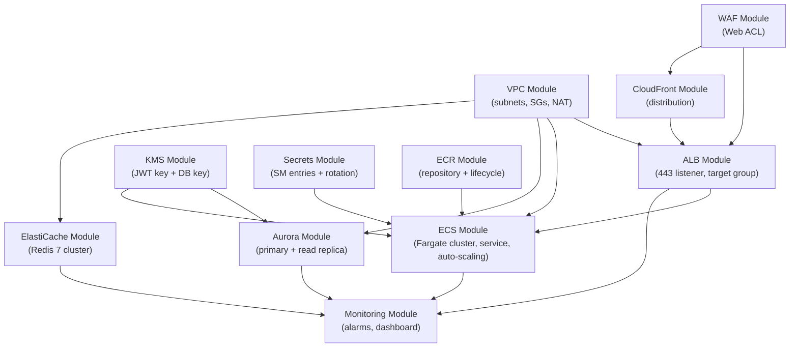
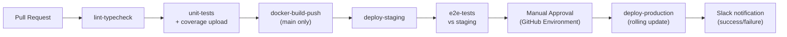

# Twitter Clone — DevOps Stories

> **Stack:** Docker · AWS ECS Fargate · Aurora PostgreSQL 17 · ElastiCache Redis 7 · AWS KMS · Secrets Manager · CloudFront · ALB · WAF · Terraform · GitHub Actions · ECR · CloudWatch · SNS

> **Scope:** Everything that takes code from a developer's machine to production — containerisation, infrastructure-as-code, CI/CD pipeline, secrets management, observability, and disaster recovery.
> For application code see the Frontend and Backend files. For test runner setup see the Testing file.

---

## Table of Contents

1. [Epic 1 — Containerisation](#epic-1--containerisation)
2. [Epic 2 — Terraform Infrastructure (Core Networking & Compute)](#epic-2--terraform-infrastructure-core-networking--compute)
3. [Epic 3 — Terraform Infrastructure (Data Layer)](#epic-3--terraform-infrastructure-data-layer)
4. [Epic 4 — Terraform Infrastructure (Security & Secrets)](#epic-4--terraform-infrastructure-security--secrets)
5. [Epic 5 — Terraform Infrastructure (Edge & CDN)](#epic-5--terraform-infrastructure-edge--cdn)
6. [Epic 6 — GitHub Actions CI/CD Pipeline](#epic-6--github-actions-cicd-pipeline)
7. [Epic 7 — Secrets Management](#epic-7--secrets-management)
8. [Epic 8 — Observability & Monitoring](#epic-8--observability--monitoring)
9. [Epic 9 — Disaster Recovery & Runbooks](#epic-9--disaster-recovery--runbooks)

---

## Epic 1 — Containerisation

**Goal:** Package the Next.js 16 application into a production-optimised, minimal Docker image ready for ECS Fargate deployment.

---

### Story 1.1 — Multi-stage Dockerfile

**As a** DevOps engineer,
**I want** a multi-stage Dockerfile that produces a minimal production image,
**so that** the container is small, secure, and consistent across all environments.

**Acceptance Criteria:**

- Three stages: `deps` (install), `builder` (compile), `runner` (runtime)
- `runner` stage uses `node:24-alpine`, runs as non-root user (`uid=1001`)
- Final image size < 300MB
- `next build` output (`standalone` mode) copied into `runner`
- `.next/static` and `public/` copied separately for correct Next.js standalone layout
- Image tested locally: `docker build -t twitter-clone . && docker run -p 3000:3000 --env-file .env.test twitter-clone`

**Tasks:**

- [ ] Set `output: 'standalone'` in `next.config.ts`
- [ ] Create `Dockerfile`:

  ```dockerfile
  FROM node:24-alpine AS deps
  WORKDIR /app
  COPY package*.json ./
  RUN npm ci --omit=dev

  FROM node:24-alpine AS builder
  WORKDIR /app
  COPY --from=deps /app/node_modules ./node_modules
  COPY . .
  RUN npm run build

  FROM node:24-alpine AS runner
  WORKDIR /app
  RUN addgroup -S appgroup && adduser -S appuser -G appgroup
  COPY --from=builder /app/.next/standalone ./
  COPY --from=builder /app/.next/static ./.next/static
  COPY --from=builder /app/public ./public
  USER appuser
  EXPOSE 3000
  ENV PORT=3000
  CMD ["node", "server.js"]
  ```

- [ ] Create `.dockerignore` excluding: `node_modules`, `.next`, `__tests__`, `tests`, `*.spec.*`, `*.test.*`, `.env*`, `coverage`, `terraform`
- [ ] Build image locally and verify `docker images` shows < 300MB
- [ ] Run container with test env vars and assert `curl localhost:3000/api/health` returns `{ status: 'ok' }`

---

### Story 1.2 — Health check endpoint and Dockerfile `HEALTHCHECK`

**As a** DevOps engineer,
**I want** a `/api/health` route and a `HEALTHCHECK` instruction in the Dockerfile,
**so that** ECS can automatically replace unhealthy tasks.

**Acceptance Criteria:**

- `GET /api/health` returns `{ status: 'ok', timestamp: ISO_STRING }` with HTTP 200
- Responds within 200ms (no DB call)
- `HEALTHCHECK` in Dockerfile: `--interval=30s --timeout=5s --start-period=10s --retries=3`
- ECS target group health check configured to `/api/health`

**Tasks:**

- [ ] Create `app/api/health/route.ts` returning `NextResponse.json({ status: 'ok', timestamp: new Date().toISOString() })`
- [ ] Add `HEALTHCHECK CMD curl -f http://localhost:3000/api/health || exit 1` to `runner` stage (install `curl` in alpine)
- [ ] Write Playwright E2E test asserting `/api/health` returns 200 and correct JSON shape
- [ ] Document health check URL in `docs/deployment.md`

---

### Story 1.3 — ECR repository and image tagging strategy

**As a** DevOps engineer,
**I want** an ECR repository with a consistent image tagging strategy,
**so that** deployments are traceable to exact git commits and rollbacks are straightforward.

**Acceptance Criteria:**

- ECR repository created with `immutable` image tags enabled
- Images tagged with full git SHA (`sha-<40-char>`) and `latest` on `main` branch
- ECR lifecycle policy: keep last 30 tagged images; delete untagged images after 1 day
- Images scanned for vulnerabilities on push (`scan-on-push: true`)

**Tasks:**

- [ ] Create `terraform/modules/ecr/main.tf` with `aws_ecr_repository` resource
- [ ] Set `image_tag_mutability = "IMMUTABLE"` and `scan_on_push = true`
- [ ] Add `aws_ecr_lifecycle_policy` resource with keep-30-tagged + delete-untagged-after-1d policy JSON
- [ ] Output repository URL for use in CI pipeline
- [ ] Document image tagging convention in `docs/deployment.md`

---

## Epic 2 — Terraform Infrastructure (Core Networking & Compute)

**Goal:** Define all VPC, ALB, and ECS resources in Terraform so the compute layer is reproducible and auto-scaling.

---

### Story 2.1 — Terraform project structure and remote state

**As a** DevOps engineer,
**I want** Terraform organized into modules with remote state in S3,
**so that** infrastructure is version-controlled, team-sharable, and safe from state conflicts.

**Acceptance Criteria:**

- `terraform/` root with `modules/` and `environments/staging/`, `environments/production/`
- Remote state backend: S3 bucket + DynamoDB table for state locking
- `terraform workspace` used to separate staging and production
- `terraform fmt`, `terraform validate`, and `terraform plan` pass in CI

**Tasks:**

- [ ] Create `terraform/` directory structure:
  ```
  terraform/
  ├── modules/
  │   ├── vpc/
  │   ├── ecs/
  │   ├── aurora/
  │   ├── elasticache/
  │   ├── kms/
  │   ├── secrets/
  │   ├── alb/
  │   ├── cloudfront/
  │   ├── waf/
  │   └── ecr/
  ├── environments/
  │   ├── staging/
  │   └── production/
  └── backend.tf
  ```
- [ ] Create `backend.tf` with S3 backend, DynamoDB lock table
- [ ] Create S3 bucket (`terraform-state-twitter-clone`) and DynamoDB table (`terraform-locks`) manually (bootstrap)
- [ ] Create `environments/staging/main.tf` and `environments/production/main.tf` calling all modules
- [ ] Add `terraform fmt --check`, `terraform validate`, `terraform plan -out=plan.tfplan` to CI workflow
- [ ] Document Terraform workflow in `docs/infrastructure.md`

---

### Story 2.2 — VPC with public and private subnets

**As a** DevOps engineer,
**I want** a VPC with separate public and private subnets across two Availability Zones,
**so that** app and data resources are network-isolated while ALB is internet-accessible.

**Acceptance Criteria:**

- VPC CIDR: `10.0.0.0/16`
- Public subnets: `10.0.1.0/24` (AZ-a), `10.0.2.0/24` (AZ-b) — hosts ALB
- Private app subnets: `10.0.11.0/24` (AZ-a), `10.0.12.0/24` (AZ-b) — hosts ECS tasks
- Private data subnets: `10.0.21.0/24` (AZ-a), `10.0.22.0/24` (AZ-b) — hosts Aurora + ElastiCache
- Internet Gateway + NAT Gateway (one per AZ for HA) for outbound ECS internet access
- Route tables and security group rules defined as code

**Tasks:**

- [ ] Create `modules/vpc/main.tf` with `aws_vpc`, `aws_subnet` (6 subnets), `aws_internet_gateway`, `aws_nat_gateway`
- [ ] Create route tables: public (IGW route), private app (NAT route), private data (no internet)
- [ ] Create security groups:
  - `sg-alb`: ingress 443 from `0.0.0.0/0`; egress to `sg-ecs`
  - `sg-ecs`: ingress 3000 from `sg-alb`; egress to `sg-aurora`, `sg-redis`, internet (for AWS APIs)
  - `sg-aurora`: ingress 5432 from `sg-ecs`
  - `sg-redis`: ingress 6379 from `sg-ecs`
- [ ] Output subnet IDs, VPC ID, security group IDs for use in other modules
- [ ] Run `terraform plan` and verify 24 resources to be created

---

### Story 2.3 — Application Load Balancer

**As a** DevOps engineer,
**I want** an ALB with an HTTPS listener, ACM certificate, and HTTP→HTTPS redirect,
**so that** all traffic is encrypted in transit.

**Acceptance Criteria:**

- ALB in public subnets, internet-facing
- HTTPS listener on port 443 with ACM certificate (validated via DNS)
- HTTP listener on port 80 redirects to HTTPS (301)
- Target group: ECS tasks on port 3000, health check at `/api/health`
- Access logs shipped to S3 bucket

**Tasks:**

- [ ] Create `modules/alb/main.tf` with `aws_lb`, `aws_lb_listener` (443 + 80), `aws_lb_target_group`
- [ ] Request ACM certificate for domain and configure DNS validation in Route 53
- [ ] Configure target group: health check path `/api/health`, interval 30s, threshold 3, protocol HTTP
- [ ] Enable ALB access logs to `s3://twitter-clone-alb-logs/`
- [ ] Output ALB DNS name and ARN

---

### Story 2.4 — ECS Fargate cluster, service, and auto-scaling

**As a** DevOps engineer,
**I want** an ECS Fargate cluster with a service that auto-scales based on CPU utilisation,
**so that** the application handles traffic spikes without manual intervention.

**Acceptance Criteria:**

- ECS cluster with Container Insights enabled
- Task definition: 1 vCPU, 2GB RAM; uses `node:24-alpine` image from ECR
- ECS service: minimum 2 tasks, maximum 10 tasks (multi-AZ)
- Auto-scaling: scale out when CPU > 70% for 2 minutes; scale in when CPU < 30% for 10 minutes
- Tasks placed in private app subnets; ECS task role with Secrets Manager + KMS permissions

**Tasks:**

- [ ] Create `modules/ecs/main.tf` with `aws_ecs_cluster` (Container Insights on), `aws_ecs_task_definition`, `aws_ecs_service`
- [ ] Task definition: `cpu = 1024`, `memory = 2048`, `network_mode = awsvpc`, `requires_compatibilities = ["FARGATE"]`
- [ ] Configure task role (`aws_iam_role`) with policies for: Secrets Manager `GetSecretValue`, KMS `Sign`/`Verify`, ECR pull, CloudWatch Logs `CreateLogStream`/`PutLogEvents`
- [ ] Configure `aws_appautoscaling_target` and two `aws_appautoscaling_policy` resources (scale-out + scale-in)
- [ ] Set `deployment_maximum_percent = 200`, `deployment_minimum_healthy_percent = 100` (rolling update with zero downtime)
- [ ] Output service name, cluster ARN for CI deploy step

---

## Epic 3 — Terraform Infrastructure (Data Layer)

**Goal:** Provision Aurora PostgreSQL 17 and ElastiCache Redis 7 with high availability, encryption at rest, and automated backups.

---

### Story 3.1 — Aurora PostgreSQL 17 cluster

**As a** DevOps engineer,
**I want** an Aurora PostgreSQL 17 cluster with a primary and one read replica,
**so that** write traffic and analytics read traffic are separated and the cluster survives an AZ failure.

**Acceptance Criteria:**

- Aurora cluster: engine `aurora-postgresql`, version `17.x`, multi-AZ
- Primary instance: `db.r7g.large` in AZ-a (writes)
- Read replica: `db.r7g.large` in AZ-b (read-only analytics queries)
- Encryption at rest using a dedicated KMS key
- Automated backups: 7-day retention, backup window `02:00–03:00 UTC`
- Parameter group: `max_connections = 200`, `log_min_duration_statement = 100ms` (slow query logging)
- Deletion protection enabled in production

**Tasks:**

- [ ] Create `modules/aurora/main.tf` with `aws_rds_cluster`, `aws_rds_cluster_instance` (primary + replica), `aws_db_subnet_group`, `aws_rds_cluster_parameter_group`
- [ ] Set `storage_encrypted = true`, `kms_key_id = var.db_kms_key_arn`
- [ ] Set `backup_retention_period = 7`, `preferred_backup_window = "02:00-03:00"`
- [ ] Enable `enabled_cloudwatch_logs_exports = ["postgresql"]` for slow query log export
- [ ] Set `deletion_protection = true` in production workspace
- [ ] Output writer endpoint URL, reader endpoint URL, and port

---

### Story 3.2 — ElastiCache Redis 7 cluster

**As a** DevOps engineer,
**I want** an ElastiCache Redis 7 cluster with cluster mode and encryption,
**so that** the cache tier is highly available and data is encrypted in transit and at rest.

**Acceptance Criteria:**

- ElastiCache Replication Group: Redis 7, cluster mode enabled, 3 shards × 1 replica = 6 nodes
- `at_rest_encryption_enabled = true`, `transit_encryption_enabled = true` (TLS)
- Subnet group covering private data subnets in both AZs
- Automatic failover enabled
- Snapshot retention: 1 day; snapshot window `03:00–04:00 UTC`
- `maxmemory-policy = allkeys-lru` (evict least-recently-used keys when full)

**Tasks:**

- [ ] Create `modules/elasticache/main.tf` with `aws_elasticache_replication_group`
- [ ] Set `cluster_mode { num_node_groups = 3, replicas_per_node_group = 1 }`
- [ ] Set `at_rest_encryption_enabled = true`, `transit_encryption_enabled = true`
- [ ] Create `aws_elasticache_subnet_group` using private data subnet IDs
- [ ] Set `automatic_failover_enabled = true`
- [ ] Create `aws_elasticache_parameter_group` with `maxmemory-policy = allkeys-lru`
- [ ] Output primary endpoint address and port

---

## Epic 4 — Terraform Infrastructure (Security & Secrets)

**Goal:** Provision KMS keys for JWT signing and DB encryption, Secrets Manager entries for all sensitive credentials, and WAF rules at the edge.

---

### Story 4.1 — AWS KMS keys

**As a** security engineer,
**I want** dedicated KMS asymmetric keys for JWT signing and KMS symmetric keys for DB encryption,
**so that** private key material never leaves the HSM.

**Acceptance Criteria:**

- KMS asymmetric key (RSA 4096, sign/verify usage) for JWT signing: `SIGN_VERIFY` key usage, `RSASSA_PKCS1_V1_5_SHA_256` spec
- KMS symmetric key for Aurora encryption: `ENCRYPT_DECRYPT` usage
- Key aliases: `alias/twitter-clone-jwt`, `alias/twitter-clone-db`
- Key rotation enabled on symmetric key (annual)
- ECS task role granted `kms:Sign`, `kms:GetPublicKey` on JWT key; `kms:Decrypt` on DB key

**Tasks:**

- [ ] Create `modules/kms/main.tf`:
  - `aws_kms_key` for JWT: `key_usage = "SIGN_VERIFY"`, `customer_master_key_spec = "RSA_4096"`
  - `aws_kms_key` for DB: `key_usage = "ENCRYPT_DECRYPT"`, `enable_key_rotation = true`
  - `aws_kms_alias` for each key
- [ ] Create KMS key policy granting ECS task role `kms:Sign`, `kms:GetPublicKey`, `kms:Verify` on JWT key
- [ ] Create KMS key policy granting Aurora service and ECS task role `kms:Decrypt`, `kms:GenerateDataKey` on DB key
- [ ] Output JWT key ID and DB key ARN for use in other modules

---

### Story 4.2 — Secrets Manager secrets

**As a** DevOps engineer,
**I want** all sensitive credentials stored in Secrets Manager with automatic rotation configured for the DB password,
**so that** no secret is ever hardcoded in task definitions, images, or config files.

**Acceptance Criteria:**

- Secrets created: `prod/db/credentials` (JSON: host, user, password, dbname), `prod/redis/url`, `prod/oauth/entra` (clientId, clientSecret, tenantId), `prod/nextauth/secret`, `prod/openai/credentials`
- `prod/db/credentials` has automatic rotation enabled using the Aurora Lambda rotator (every 30 days)
- ECS task definition `secrets` section references each Secrets Manager ARN
- Task role has `secretsmanager:GetSecretValue` scoped to only these 5 secret ARNs

**Tasks:**

- [ ] Create `modules/secrets/main.tf` with `aws_secretsmanager_secret` + `aws_secretsmanager_secret_version` for each secret (initial placeholder values)
- [ ] Enable rotation on `prod/db/credentials` using `aws_secretsmanager_secret_rotation` with Aurora Lambda rotator ARN
- [ ] Update `modules/ecs/main.tf` task definition to inject secrets from Secrets Manager ARNs
- [ ] Create IAM policy for task role: `secretsmanager:GetSecretValue` on specific secret ARNs only (least-privilege)
- [ ] Write runbook `docs/secret-rotation.md` describing manual rotation procedure and verification steps

---

### Story 4.3 — AWS WAF Web ACL

**As a** security engineer,
**I want** an AWS WAF Web ACL attached to both the ALB and CloudFront distribution,
**so that** common attack patterns and abusive traffic are blocked at the edge.

**Acceptance Criteria:**

- WAF Web ACL with managed rule groups: `AWSManagedRulesCommonRuleSet`, `AWSManagedRulesSQLiRuleSet`, `AWSManagedRulesKnownBadInputsRuleSet`
- Rate-based rule: block IPs sending > 2000 requests per 5 minutes
- Geo-block rule: restrict to allowed countries (configurable via variable)
- WAF logging to CloudWatch Log Group with 30-day retention
- Web ACL associated with ALB (regional) and CloudFront (global, `us-east-1`)

**Tasks:**

- [ ] Create `modules/waf/main.tf` with `aws_wafv2_web_acl` (scope: `REGIONAL` for ALB, `CLOUDFRONT` for CF)
- [ ] Add `aws_wafv2_web_acl_association` linking Web ACL to ALB ARN
- [ ] Add 3 managed rule groups as `managed_rule_group_statement` blocks
- [ ] Add `rate_based_statement` rule: limit 2000 req / 5 min per IP, action `block`
- [ ] Add optional `geo_match_statement` rule controlled by `var.allowed_countries`
- [ ] Enable WAF logging: `aws_wafv2_web_acl_logging_configuration` pointing at CloudWatch log group
- [ ] Test WAF by sending a known SQL injection payload and asserting 403 response

---

## Epic 5 — Terraform Infrastructure (Edge & CDN)

**Goal:** CloudFront distribution for static asset caching, HTTPS termination, and global edge performance.

---

### Story 5.1 — CloudFront distribution

**As a** DevOps engineer,
**I want** a CloudFront distribution fronting the ALB and caching `_next/static/` assets,
**so that** static files are served from edge PoPs with high cache hit rates.

**Acceptance Criteria:**

- CloudFront origin: ALB DNS name (HTTPS only, `OAC` not needed for ALB)
- Default behaviour: forward all requests to ALB; no caching (TTL 0) for HTML/API
- `/_next/static/*` behaviour: cache with TTL 365 days (immutable assets, cache-busted by hash)
- `/public/*` behaviour: cache with TTL 86400 (1 day)
- HTTPS only (`redirect-to-https`); `TLSv1.2_2021` security policy
- Custom domain via Route 53 CNAME to CloudFront distribution

**Tasks:**

- [ ] Create `modules/cloudfront/main.tf` with `aws_cloudfront_distribution`
- [ ] Configure `origin` block pointing at ALB DNS name with HTTPS protocol policy
- [ ] Define 3 `ordered_cache_behavior` blocks: `/_next/static/*` (TTL 31536000), `/public/*` (TTL 86400), default (TTL 0)
- [ ] Set `viewer_certificate` to ACM cert (must be in `us-east-1` for CloudFront)
- [ ] Associate WAF Web ACL (CloudFront scope) with distribution
- [ ] Create `aws_route53_record` CNAME pointing domain → CloudFront distribution domain
- [ ] Verify static asset cache hit rate in CloudWatch metric `CacheHitRate` after first deploy

---

## Epic 6 — GitHub Actions CI/CD Pipeline

**Goal:** Fully automated CI/CD pipeline from PR to production with mandatory quality gates, zero-downtime deployment, and manual approval for production.

---

### Story 6.1 — CI pipeline (lint, typecheck, unit tests)

**As a** developer,
**I want** a CI pipeline that runs lint, typecheck, and unit tests on every push and PR,
**so that** broken code is caught before it can be merged.

**Acceptance Criteria:**

- Triggers: `push` to any branch, `pull_request` targeting `main`
- `lint-typecheck` job: `npm run lint && npm run typecheck`; fails fast
- `unit-tests` job (depends on `lint-typecheck`): `npm run test:coverage`; uploads `coverage/` artifact
- Both jobs run on `ubuntu-24.04`; Node 24 cached via `actions/setup-node`
- Coverage summary posted as PR comment using artifact JSON

**Tasks:**

- [ ] Create `.github/workflows/ci.yml`
- [ ] Add `lint-typecheck` job:
  ```yaml
  - uses: actions/checkout@v4
  - uses: actions/setup-node@v4
    with: { node-version: "24", cache: "npm" }
  - run: npm ci
  - run: npm run lint && npm run typecheck
  ```
- [ ] Add `unit-tests` job with `needs: lint-typecheck`:
  ```yaml
  - run: npm run test:coverage
  - uses: actions/upload-artifact@v4
    with: { name: coverage, path: coverage/ }
  ```
- [ ] Add coverage comment step using `davelosert/vitest-coverage-report-action` or custom script reading `coverage/json-summary`
- [ ] Configure branch protection: `lint-typecheck` + `unit-tests` required for `main` merges

---

### Story 6.2 — Docker build and ECR push

**As a** DevOps engineer,
**I want** the CI pipeline to build the Docker image and push it to ECR on every merge to `main`,
**so that** a deployment-ready image is always available.

**Acceptance Criteria:**

- Triggers: `push` to `main` only
- Image tagged with `sha-<GIT_SHA>` and `latest`
- ECR login via `aws-actions/amazon-ecr-login`
- Build cache via `--cache-from type=gha,scope=main` + `--cache-to type=gha,scope=main`
- Vulnerability scan result checked after push: if `CRITICAL` findings → fail build
- Image digest stored as job output for use in ECS deploy step

**Tasks:**

- [ ] Add `docker-build-push` job to `ci.yml` with `needs: unit-tests` and `if: github.ref == 'refs/heads/main'`
- [ ] Configure AWS credentials using `aws-actions/configure-aws-credentials` with OIDC role (not long-lived keys)
- [ ] Run `aws ecr get-login-password | docker login` via `aws-actions/amazon-ecr-login`
- [ ] Build with BuildKit cache: `docker buildx build --cache-from type=gha --cache-to type=gha -t $ECR_URI:sha-${{ github.sha }} -t $ECR_URI:latest --push .`
- [ ] Run `aws ecr describe-image-scan-findings` and fail if `CRITICAL` vulnerability found
- [ ] Set `outputs: { image: '$ECR_URI:sha-${{ github.sha }}' }` for downstream jobs
- [ ] Store `AWS_ROLE_ARN` (OIDC-federated) and `ECR_REGISTRY` as GitHub Actions secrets

---

### Story 6.3 — Staging deploy and E2E gate

**As a** DevOps engineer,
**I want** the pipeline to automatically deploy to staging and run E2E tests after a successful image build,
**so that** only regression-free code advances to production.

**Acceptance Criteria:**

- `deploy-staging` job: updates ECS service in staging with new image; waits for service stability
- E2E tests run against staging URL with `playwright.config.ts` `baseURL = STAGING_URL`
- `e2e-tests` job fails → pipeline stops; production deploy does not run
- Staging environment URL output posted as pipeline annotation

**Tasks:**

- [ ] Add `deploy-staging` job with `needs: docker-build-push`:
  - Use `aws ecs register-task-definition` with new image digest
  - Use `aws ecs update-service --cluster staging --service twitter-clone --task-definition <new_td_arn>`
  - Use `aws ecs wait services-stable --cluster staging --services twitter-clone` (timeout 10min)
- [ ] Add `e2e-tests` job with `needs: deploy-staging`:
  - `npm run test:e2e` with `PLAYWRIGHT_BASE_URL=${{ env.STAGING_URL }}`
  - Upload Playwright report as artifact on failure
- [ ] Set `STAGING_URL` as GitHub Actions environment variable

---

### Story 6.4 — Production deploy with manual approval

**As a** DevOps engineer,
**I want** production deployment to require a manual approval step,
**so that** no code reaches production without a human sign-off.

**Acceptance Criteria:**

- `deploy-production` job: gated by GitHub Environment `production` with required reviewers
- Deploys same image digest that was promoted through staging (no rebuild)
- Uses `aws ecs update-service --force-new-deployment` with rolling update (zero downtime)
- Waits for service stability before marking job as successful
- Sends Slack notification on successful and failed production deploys

**Tasks:**

- [ ] Create GitHub Environment `production` with required reviewer approval
- [ ] Add `deploy-production` job with `needs: e2e-tests` and `environment: production`:
  - Register updated task definition with the staging-tested image
  - `aws ecs update-service --cluster production --service twitter-clone --force-new-deployment`
  - `aws ecs wait services-stable --cluster production --services twitter-clone --timeout 900`
- [ ] Add Slack notification step using `slackapi/slack-github-action` on job success + failure
- [ ] Document rollback procedure: re-run the previous successful `deploy-production` with prior `sha-*` tag

---

### Story 6.5 — Infrastructure plan in CI (Terraform)

**As a** DevOps engineer,
**I want** `terraform plan` to run on every PR that touches `terraform/`,
**so that** infrastructure changes are reviewed before they are applied.

**Acceptance Criteria:**

- `terraform-plan` job triggers only on PRs with changes to `terraform/**`
- Runs `terraform fmt --check`, `terraform validate`, `terraform plan -out=plan.tfplan`
- Plan output posted as PR comment (summary of resources to add/change/destroy)
- `terraform apply` is manual-only (never automatic) for production

**Tasks:**

- [ ] Create `.github/workflows/terraform.yml` with `on: pull_request: paths: ['terraform/**']`
- [ ] Add steps: `hashicorp/setup-terraform@v3`, `terraform init`, `terraform fmt --check`, `terraform validate`, `terraform plan -no-color -out=plan.tfplan`
- [ ] Post plan output as PR comment using `actions/github-script`
- [ ] Add warning comment if plan includes any `destroy` actions (red flag)
- [ ] Document: `terraform apply` must be run manually by a DevOps engineer after PR merge

---

## Epic 7 — Secrets Management

**Goal:** Establish secure secret delivery to ECS tasks and enforce zero-secret-in-code policies.

---

### Story 7.1 — OIDC-based AWS authentication for GitHub Actions

**As a** DevOps engineer,
**I want** GitHub Actions to authenticate to AWS using OIDC (not long-lived access keys),
**so that** there are no AWS credentials stored as GitHub Secrets.

**Acceptance Criteria:**

- AWS OIDC identity provider configured for `token.actions.githubusercontent.com`
- IAM role `github-actions-role` with trust policy scoped to the specific GitHub repo and `main` branch
- Role allows: `ecr:*`, `ecs:UpdateService`, `ecs:RegisterTaskDefinition`, `ecs:DescribeServices`, `secretsmanager:GetSecretValue` (for CD only), `kms:GetPublicKey`
- `aws-actions/configure-aws-credentials` uses `role-to-assume` — no `AWS_ACCESS_KEY_ID` secret needed

**Tasks:**

- [ ] Create `aws_iam_openid_connect_provider` for `token.actions.githubusercontent.com` in Terraform
- [ ] Create `aws_iam_role` with trust policy: `Condition: { StringLike: { 'token.actions.githubusercontent.com:sub': 'repo:org/twitter-clone:ref:refs/heads/main' } }`
- [ ] Attach minimum-permission policy to role (ECR push, ECS deploy, no full admin)
- [ ] Update all CI jobs to use `role-to-assume: ${{ secrets.AWS_ROLE_ARN }}`
- [ ] Remove any existing `AWS_ACCESS_KEY_ID`/`AWS_SECRET_ACCESS_KEY` GitHub Secrets
- [ ] Test: manually run CI workflow and verify AWS commands succeed with OIDC credentials

---

### Story 7.2 — Secret injection into ECS tasks

**As a** DevOps engineer,
**I want** all application secrets injected into ECS containers via Secrets Manager at task start,
**so that** no secret is ever baked into a Docker image, task definition, or environment file.

**Acceptance Criteria:**

- Task definition `containerDefinitions.secrets` array references Secrets Manager ARNs for: `DATABASE_URL`, `REDIS_URL`, `NEXTAUTH_SECRET`, `ENTRA_CLIENT_SECRET`, `AZURE_OPENAI_API_KEY`
- `KMS_JWT_KEY_ID` passed as plain `environment` variable (it's a key ID, not a secret value)
- Task role has `secretsmanager:GetSecretValue` on exactly these 5 secret ARNs (nothing broader)
- Verify: `docker exec <task>` does not expose any secret in environment listing to non-root processes

**Tasks:**

- [ ] Update `modules/ecs/main.tf` task definition `container_definitions` JSON to add `secrets` array
- [ ] Scope task role IAM policy to exact Secrets Manager ARNs using `Condition: StringEquals` ARN list
- [ ] Add `environment` entry for `KMS_JWT_KEY_ID` referencing module output from `modules/kms`
- [ ] Test locally by running a container with a mock ECS metadata endpoint and verifying secret retrieval

---

### Story 7.3 — Secret rotation runbook and automation

**As a** security engineer,
**I want** Aurora DB password rotation automated and a runbook for rotating other secrets,
**so that** secret hygiene is maintained with minimal manual effort.

**Acceptance Criteria:**

- `prod/db/credentials` automatically rotated every 30 days using the `SecretsManagerRDSPostgreSQLRotationSingleUser` Lambda
- On rotation: new password applied to Aurora, ECS tasks recycled to pick up new secret
- Runbook in `docs/secret-rotation.md` covering: DB auto-rotation schedule, manual steps for OAuth and API key rotation, verification procedure

**Tasks:**

- [ ] Enable `aws_secretsmanager_secret_rotation` in Terraform with rotation Lambda ARN and `rotation_rules { automatically_after_days = 30 }`
- [ ] Create EventBridge rule to trigger ECS service update after successful DB secret rotation
- [ ] Write `docs/secret-rotation.md`:
  - Section 1: DB auto-rotation (automatic, just verify ECS tasks restart)
  - Section 2: OAuth secret rotation (manual: update in Entra portal → update Secrets Manager → trigger ECS deploy)
  - Section 3: API key rotation (manual: generate new key in Azure portal → update Secrets Manager → trigger ECS deploy)
  - Section 4: Verification checklist (health check passes, login works, AI suggestions work)

---

## Epic 8 — Observability & Monitoring

**Goal:** Full-stack observability with CloudWatch metrics, alarms, dashboards, and structured application logging.

---

### Story 8.1 — Structured application logging

**As a** developer,
**I want** the Next.js application to emit structured JSON logs to CloudWatch,
**so that** logs are searchable and actionable in production.

**Acceptance Criteria:**

- `pino` logger configured in `src/lib/logger.ts` with JSON output in production, pretty-print in dev
- All Server Actions, services, and API routes log: request ID, user ID (if available), action name, duration, outcome
- Prisma slow queries (> 100ms) logged at `warn` level with query text and duration
- Logs include `environment`, `gitSha`, and `appVersion` fields
- ECS log driver: `awslogs` streaming to CloudWatch Log Group `/twitter-clone/{environment}/app`

**Tasks:**

- [ ] Install `pino` and `pino-pretty`
- [ ] Create `src/lib/logger.ts` with `NODE_ENV`-based transport: JSON in production, pretty in dev
- [ ] Add `GIT_SHA` and `APP_VERSION` build-time env vars (injected in `next.config.ts`)
- [ ] Wrap all Server Actions with a `withLogging(action, name)` higher-order function
- [ ] Enable Prisma `$on('query', ...)` event: log queries > 100ms via `logger.warn`
- [ ] Configure ECS task definition `logConfiguration`: `logDriver = awslogs`, `awslogs-group = /twitter-clone/production/app`, `awslogs-stream-prefix = ecs`
- [ ] Create CloudWatch Log Group in Terraform with 30-day retention

---

### Story 8.2 — CloudWatch alarms

**As a** DevOps engineer,
**I want** CloudWatch alarms on all critical metrics with SNS notification,
**so that** on-call engineers are alerted immediately on incidents.

**Acceptance Criteria:**

- Alarms defined:
  - ECS CPU utilisation > 80% for 2 minutes → `HIGH_CPU`
  - Aurora write latency > 200ms for 5 minutes → `HIGH_DB_LATENCY`
  - ElastiCache evictions > 0 for 5 minutes → `CACHE_EVICTIONS`
  - ALB 5xx error rate > 1% for 5 minutes → `HIGH_ERROR_RATE`
  - ALB target response time > 2s for 5 minutes → `HIGH_RESPONSE_TIME`
- All alarms notify SNS topic `twitter-clone-alerts`
- SNS topic has email subscription (configurable via variable) and optional PagerDuty integration

**Tasks:**

- [ ] Create `modules/monitoring/main.tf` with 5 `aws_cloudwatch_metric_alarm` resources
- [ ] Create `aws_sns_topic` and `aws_sns_topic_subscription` (email protocol)
- [ ] Set `treat_missing_data = "notBreaching"` on all alarms
- [ ] Configure ALB 5xx alarm: `Namespace = AWS/ApplicationELB`, `MetricName = HTTPCode_ELB_5XX_Count`, `Statistic = Sum`
- [ ] Configure ElastiCache alarm: `Namespace = AWS/ElastiCache`, `MetricName = Evictions`, `Statistic = Sum`
- [ ] Run `terraform plan` and verify 5 alarm resources + 1 SNS topic + subscription

---

### Story 8.3 — Custom CloudWatch metrics

**As a** DevOps engineer,
**I want** custom application metrics for feed cache hit rate and tweet creation rate,
**so that** I can understand application health beyond AWS-native metrics.

**Acceptance Criteria:**

- `FeedService.getHomeFeed` emits: `TwitterClone/FeedCacheHits` (1) or `TwitterClone/FeedCacheMisses` (1) per call
- `createTweetAction` emits `TwitterClone/TweetsCreated` (1) per successful tweet
- Metrics published via `@aws-sdk/client-cloudwatch` `PutMetricData` API
- Cache hit rate alarm: `FeedCacheHits / (FeedCacheHits + FeedCacheMisses) < 0.8` → alert

**Tasks:**

- [ ] Install `@aws-sdk/client-cloudwatch`
- [ ] Create `src/lib/metrics.ts` with `putMetric(name, value, unit, dimensions)` helper
- [ ] Emit `FeedCacheHits` / `FeedCacheMisses` in `FeedService.getHomeFeed` hit/miss branches
- [ ] Emit `TweetsCreated` in `createTweetAction` on successful Prisma insert
- [ ] Create CloudWatch metric math alarm for cache hit rate using `METRICS_MATH`
- [ ] Add alarm to SNS topic for hit rate < 80%

---

### Story 8.4 — CloudWatch dashboard

**As a** DevOps engineer,
**I want** a CloudWatch dashboard showing all key metrics in one view,
**so that** on-call engineers have a single pane of glass during incidents.

**Acceptance Criteria:**

- Dashboard `twitter-clone-production` with 6 widgets:
  1. ECS CPU and Memory utilisation (line charts)
  2. ALB request count, 5xx rate, response time (line charts)
  3. Aurora write latency, read latency, connections (line chart)
  4. ElastiCache hit rate, evictions (line chart)
  5. Feed cache hit rate (custom metric, line chart)
  6. Tweet creation rate (custom metric, bar chart)

**Tasks:**

- [ ] Create `aws_cloudwatch_dashboard` resource in Terraform with `dashboard_body` JSON
- [ ] Define 6 widget JSON blocks using CloudWatch dashboard widget schema
- [ ] Use `period = 60` (1-minute resolution) for all live metrics
- [ ] Set time range default to last 3 hours
- [ ] Output dashboard URL in Terraform outputs

---

## Epic 9 — Disaster Recovery & Runbooks

**Goal:** Document and test recovery procedures so the team can restore service quickly from any failure scenario.

---

### Story 9.1 — Aurora point-in-time restore runbook

**As a** DevOps engineer,
**I want** a tested runbook for restoring Aurora from a point-in-time backup,
**so that** data can be recovered after accidental deletion or corruption.

**Acceptance Criteria:**

- Runbook in `docs/disaster-recovery.md` covers Aurora restore steps
- Steps verified in staging: simulate data loss → restore → verify application works
- RTO target documented: < 30 minutes for PITR
- RPO target documented: < 5 minutes (Aurora continuous backup)

**Tasks:**

- [ ] Write `docs/disaster-recovery.md` Section 1: Aurora PITR steps:
  1. Identify target restore time from CloudWatch slow query logs or application logs
  2. `aws rds restore-db-cluster-to-point-in-time --source-db-cluster-identifier production-cluster --restore-to-time <ISO>`
  3. Update `prod/db/credentials` Secrets Manager with new cluster endpoint
  4. Trigger ECS deploy to pick up new DB endpoint
  5. Verify with `GET /api/health` and smoke test key endpoints
- [ ] Test runbook in staging: delete 5 seeded tweets → PITR restore → verify tweets present
- [ ] Document RTO/RPO in runbook and in `docs/infrastructure.md`

---

### Story 9.2 — ECS task rollback runbook

**As a** DevOps engineer,
**I want** a runbook for rolling back a bad ECS deployment,
**so that** production can be restored within 5 minutes of a bad deploy.

**Acceptance Criteria:**

- Rollback procedure uses a previous ECR image tag (stored in GitHub Actions job history)
- Rollback achievable with a single CLI command or GitHub Actions re-run
- Runbook covers: how to identify a bad deploy (alarm → CloudWatch logs), how to trigger rollback, how to verify recovery

**Tasks:**

- [ ] Write `docs/disaster-recovery.md` Section 2: ECS Rollback:
  1. Identify previous healthy image: `aws ecr describe-images --repository-name twitter-clone --query 'sort_by(imageDetails, &imagePushedAt)[-2]'`
  2. Register new task definition with previous image tag
  3. `aws ecs update-service --cluster production --service twitter-clone --task-definition <prev_td_arn> --force-new-deployment`
  4. `aws ecs wait services-stable` and verify health check
- [ ] Add `rollback` GitHub Actions workflow with `workflow_dispatch` input for `image_tag` parameter
- [ ] Test rollback in staging: deploy a deliberately broken image → trigger rollback → verify recovery

---

### Story 9.3 — ElastiCache failover and cold-start runbook

**As a** DevOps engineer,
**I want** a runbook for handling ElastiCache failures and cache cold-starts,
**so that** the team knows how to restore cache performance without data loss.

**Acceptance Criteria:**

- Runbook covers: automatic failover (ElastiCache Multi-AZ), cache cold-start procedure, monitoring cache warm-up
- Cold-start procedure: how to pre-warm `feed:userId` and `profile:handle` keys after a cache flush
- Recovery verified: cache hit rate returns to > 80% within 5 minutes

**Tasks:**

- [ ] Write `docs/disaster-recovery.md` Section 3: ElastiCache Recovery:
  1. Automatic failover: ElastiCache promotes replica automatically; no action needed beyond monitoring
  2. If full cache flush required: run `scripts/warm-cache.ts` — fetches top 100 active users' feeds from DB and populates Redis
  3. Monitor `FeedCacheHits` / `FeedCacheMisses` custom metric — expect hit rate to rise within 5 min as users browse
- [ ] Create `scripts/warm-cache.ts` CLI script that pre-warms Redis for the top 100 active users
- [ ] Test cold-start: flush staging Redis → run warm-cache script → assert hit rate > 80% in CloudWatch

---

## Summary

| Epic                                | Stories        | Primary Tech                              |
| ----------------------------------- | -------------- | ----------------------------------------- |
| 1 — Containerisation                | 3              | Docker, ECR                               |
| 2 — Terraform: Networking & Compute | 4              | VPC, ALB, ECS Fargate, Terraform          |
| 3 — Terraform: Data Layer           | 2              | Aurora PostgreSQL 17, ElastiCache Redis 7 |
| 4 — Terraform: Security & Secrets   | 3              | KMS, Secrets Manager, WAF                 |
| 5 — Terraform: Edge & CDN           | 1              | CloudFront, Route 53                      |
| 6 — GitHub Actions CI/CD            | 5              | GitHub Actions, OIDC, ECS rolling deploy  |
| 7 — Secrets Management              | 3              | Secrets Manager, OIDC, secret rotation    |
| 8 — Observability                   | 4              | CloudWatch, pino, custom metrics, alarms  |
| 9 — Disaster Recovery               | 3              | PITR, rollback runbooks, cold-start       |
| **Total**                           | **28 stories** |                                           |

---

## Infrastructure Dependency Map



## CI/CD Pipeline Flow


