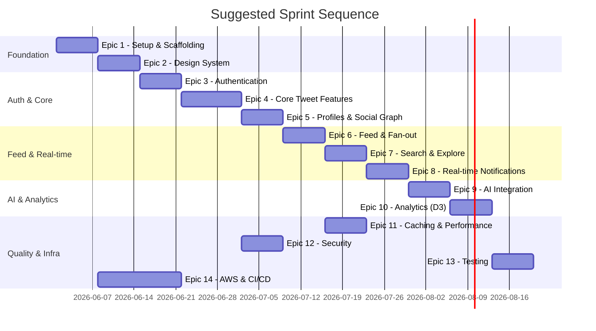

# Twitter Clone — Epics, User Stories & Tasks

> Full lifecycle backlog for the React 19 · Next.js 16 · PostgreSQL 17 · Redis 7 · AWS Twitter Clone

---

## Table of Contents

1. [Epic 1 — Project Setup & Scaffolding](#epic-1--project-setup--scaffolding)
2. [Epic 2 — Design System](#epic-2--design-system)
3. [Epic 3 — Authentication & Authorization](#epic-3--authentication--authorization)
4. [Epic 4 — Core Tweet Functionality](#epic-4--core-tweet-functionality)
5. [Epic 5 — User Profiles & Social Graph](#epic-5--user-profiles--social-graph)
6. [Epic 6 — Feed Architecture & Fan-out](#epic-6--feed-architecture--fan-out)
7. [Epic 7 — Search & Explore](#epic-7--search--explore)
8. [Epic 8 — Real-time Notifications](#epic-8--real-time-notifications)
9. [Epic 9 — AI Integration (CopilotKit v2)](#epic-9--ai-integration-copilotkit-v2)
10. [Epic 10 — Analytics Dashboard (D3.js)](#epic-10--analytics-dashboard-d3js)
11. [Epic 11 — Caching & Performance](#epic-11--caching--performance)
12. [Epic 12 — Security & Rate Limiting](#epic-12--security--rate-limiting)
13. [Epic 13 — Testing Strategy](#epic-13--testing-strategy)
14. [Epic 14 — AWS Infrastructure & CI/CD](#epic-14--aws-infrastructure--cicd)

---

## Epic 1 — Project Setup & Scaffolding

**Goal:** Bootstrap the monorepo with all tooling configured so every engineer can start feature work from day one.

---

### Story 1.1 — Initialize Next.js 16 App Router project

**As a** developer,
**I want** the Next.js 16 project initialized with TypeScript strict mode and the App Router,
**so that** the team has a consistent, type-safe starting point.

**Acceptance Criteria:**

- `next@16` installed with `app/` directory structure
- `tsconfig.json` set to `strict: true`, path aliases configured (`@/`)
- ESLint 9 flat config (`eslint.config.mjs`) with Next.js + TypeScript rules
- Prettier configured with shared `.prettierrc`
- Stylelint configured for CSS/Tailwind rules
- `package.json` scripts: `dev`, `build`, `lint`, `format`, `typecheck`

**Tasks:**

- [ ] `npx create-next-app@latest` with App Router and TypeScript flags
- [ ] Set `strict: true` and add path aliases to `tsconfig.json`
- [ ] Install and configure ESLint 9 flat config with `@eslint/js`, `typescript-eslint`, `eslint-config-next`
- [ ] Install Prettier and create `.prettierrc` + `.prettierignore`
- [ ] Install Stylelint and create `stylelint.config.mjs` for Tailwind CSS rules
- [ ] Add `lint-staged` + `husky` pre-commit hooks
- [ ] Verify `next build` succeeds on a clean clone

---

### Story 1.2 — Configure Tailwind CSS 4

**As a** developer,
**I want** Tailwind CSS 4 installed with a CSS-first `@theme` config,
**so that** the team can use design tokens without a JavaScript config file.

**Acceptance Criteria:**

- Tailwind CSS 4 imported via `@import 'tailwindcss'` in `globals.css`
- Design token layer defined with `@theme { ... }` block
- Dark mode enabled via `.dark` class variant
- `@layer components` utility classes scaffolded

**Tasks:**

- [ ] Install `tailwindcss@4` and remove legacy `tailwind.config.js`
- [ ] Create `app/globals.css` with `@import 'tailwindcss'` and `@theme {}` block
- [ ] Define brand colour palette (`--color-brand-50` → `--color-brand-950`)
- [ ] Define typography, spacing, radius, and shadow tokens
- [ ] Configure dark mode tokens under `@theme dark {}`
- [ ] Add `@layer components {}` for shared utility class patterns (`.tweet-card`, `.btn-primary`)
- [ ] Validate purge is working in production build (no unused styles)

---

### Story 1.3 — Set up shared folder structure

**As a** developer,
**I want** a well-defined folder structure enforced from the start,
**so that** code is discoverable and responsibilities are clear.

**Acceptance Criteria:**

- `src/` root with sub-folders: `app/`, `components/`, `lib/`, `services/`, `repositories/`, `shared/`, `hooks/`, `types/`
- `shared/schemas/` contains barrel-exported Zod schemas
- `lib/sdk/` contains the Custom SDK skeleton
- Path alias `@/` maps to `src/`

**Tasks:**

- [ ] Create folder skeleton with `README.md` in each top-level folder explaining its purpose
- [ ] Create `src/shared/schemas/index.ts` barrel export
- [ ] Create `src/lib/sdk/index.ts` with stub exports
- [ ] Create `src/services/` stubs: `FeedService`, `NotificationService`, `SearchService`, `RateLimitService`, `EncryptionService`
- [ ] Create `src/repositories/` stubs: `TweetRepository`, `UserRepository`, `FollowRepository`
- [ ] Document folder conventions in `CONTRIBUTING.md`

---

### Story 1.4 — Configure Prisma 7 with PostgreSQL

**As a** developer,
**I want** Prisma 7 configured and pointing at a local PostgreSQL 17 instance,
**so that** I can run migrations and interact with the database immediately.

**Acceptance Criteria:**

- `prisma/schema.prisma` defines all entities: `User`, `Tweet`, `Like`, `Follow`, `Hashtag`, `TweetHashtag`, `Notification`
- `DATABASE_URL` loaded from `.env.local` via `dotenv`
- `prisma migrate dev` runs without errors
- Prisma Client generated and importable as `@/lib/prisma`

**Tasks:**

- [ ] Install `prisma@7` and `@prisma/client`
- [ ] Define `prisma/schema.prisma` with all models and relations (see ERD in architecture doc)
- [ ] Add indexes: GIN on `Tweet.content` for full-text search, B-tree on `Tweet.authorId`, `Tweet.createdAt`
- [ ] Create `src/lib/prisma.ts` singleton with connection pooling guard (`globalThis.__prisma`)
- [ ] Run `prisma migrate dev --name init` and commit migration
- [ ] Create `prisma/seed.ts` with test users and tweets
- [ ] Add `prisma:generate`, `prisma:migrate`, `prisma:seed` npm scripts

---

### Story 1.5 — Configure Redis client

**As a** developer,
**I want** a Redis 7 client configured and accessible via a typed singleton,
**so that** caching and pub/sub features can be built consistently.

**Acceptance Criteria:**

- `ioredis` client instantiated as singleton in `src/lib/redis.ts`
- Environment variable `REDIS_URL` loaded from `.env.local`
- Helper typed wrappers: `get`, `set`, `del`, `incr`, `zadd`, `publish`, `subscribe`

**Tasks:**

- [ ] Install `ioredis` and `@types/ioredis`
- [ ] Create `src/lib/redis.ts` with singleton pattern and reconnect strategy
- [ ] Write typed helper functions covering all key operations used in the design
- [ ] Add `REDIS_URL` to `.env.example` with localhost default
- [ ] Write unit tests for Redis helpers using `ioredis-mock`

---

## Epic 2 — Design System

**Goal:** Build the Radix UI + Tailwind CSS 4 component library that all features consume.

---

### Story 2.1 — Install and configure Radix UI primitives

**As a** developer,
**I want** all required Radix UI packages installed with a consistent import pattern,
**so that** accessible, unstyled primitives are ready for composition.

**Acceptance Criteria:**

- Installed packages: `@radix-ui/react-dialog`, `react-sheet`, `react-popover`, `react-dropdown-menu`, `react-avatar`, `react-tooltip`, `react-hover-card`, `react-switch`, `react-checkbox`, `react-radio-group`, `react-scroll-area`, `react-tabs`, `react-separator`
- Each primitive has a thin wrapper component in `src/components/ui/`

**Tasks:**

- [ ] Install all Radix UI packages
- [ ] Create wrapper components with Tailwind classes: `Dialog`, `Sheet`, `Popover`, `DropdownMenu`, `Avatar`, `Tooltip`, `HoverCard`, `Switch`, `Checkbox`, `RadioGroup`, `ScrollArea`, `Tabs`, `Separator`
- [ ] Export all from `src/components/ui/index.ts`
- [ ] Add `data-[state]` and `data-[disabled]` Tailwind variant styles
- [ ] Add `animate-in` / `animate-out` keyframes via Tailwind for modal transitions
- [ ] Write Vitest + React Testing Library snapshot tests for each primitive wrapper

---

### Story 2.2 — Build composed components

**As a** designer/developer,
**I want** higher-level components (`TweetCard`, `UserCard`, `TrendingItem`, `NotificationItem`, `SearchInput`) built from primitives,
**so that** features can assemble UIs without reimplementing atoms.

**Acceptance Criteria:**

- `TweetCard` renders avatar, handle, timestamp, content, and action bar slot
- `UserCard` renders avatar, display name, handle, bio, and a follow-button slot
- `TrendingItem` renders hashtag and count badge
- `NotificationItem` renders icon, body text, and relative timestamp
- `SearchInput` renders with icon, clear button, and keyboard accessibility

**Tasks:**

- [ ] Build `TweetCard` with RSC-compatible props interface
- [ ] Build `UserCard` with RSC-compatible props interface
- [ ] Build `TrendingItem`
- [ ] Build `NotificationItem` with notification type icons (LIKE, FOLLOW, REPLY, RETWEET)
- [ ] Build `SearchInput` (Client Component) with controlled input and clear handler
- [ ] Write RTL tests for each composed component covering content rendering and accessibility

---

### Story 2.3 — Implement dark mode theming

**As a** user,
**I want** to toggle between light and dark mode,
**so that** I can use the app comfortably in any lighting condition.

**Acceptance Criteria:**

- Theme persists in `localStorage`
- `ThemeContext` exposes `theme` and `toggleTheme`
- `.dark` class applied to `<html>` element
- All design tokens respond correctly in both modes

**Tasks:**

- [ ] Create `src/contexts/ThemeContext.tsx` with `useLocalStorage` hook
- [ ] Apply `.dark` class to `document.documentElement` on toggle
- [ ] Wire `ThemeContext` into root layout via provider
- [ ] Add `ThemeToggle` button component using `Switch` primitive
- [ ] Define all dark-mode token overrides in `globals.css`
- [ ] Write RTL test verifying class toggle and localStorage persistence

---

## Epic 3 — Authentication & Authorization

**Goal:** Secure the application with NextAuth 5 + Microsoft Entra ID + JWT signed by AWS KMS.

---

### Story 3.1 — Set up NextAuth 5 with Microsoft Entra ID provider

**As a** user,
**I want** to sign in with my Microsoft account,
**so that** I can access the platform without creating a new password.

**Acceptance Criteria:**

- "Sign in with Microsoft" button initiates OAuth 2.0 PKCE flow
- Callback from Entra ID exchanges code for `id_token`
- User record upserted in PostgreSQL via Prisma on each sign-in
- `httpOnly` session cookie set after successful auth

**Tasks:**

- [ ] Install `next-auth@5` and `@auth/prisma-adapter`
- [ ] Create `src/auth.ts` with `MicrosoftEntraID` provider config
- [ ] Create `app/api/auth/[...nextauth]/route.ts` handler
- [ ] Configure `clientId`, `clientSecret`, `tenantId` loaded from Secrets Manager (or `.env.local` for dev)
- [ ] Implement Prisma adapter upsert: create user on first sign-in, update `updatedAt` on subsequent
- [ ] Generate random unique `handle` from display name on first sign-in
- [ ] Write integration test for callback flow using NextAuth mock session

---

### Story 3.2 — JWT signing via AWS KMS

**As a** security engineer,
**I want** session JWTs signed using an AWS KMS asymmetric key,
**so that** signing keys never leave the KMS HSM.

**Acceptance Criteria:**

- NextAuth `jwt` callbacks call `KMS.sign()` for signing and `KMS.verify()` for verification
- Public key cached in memory (refreshed every 24h) to avoid KMS call on every request
- JWT payload contains `sub`, `handle`, `iat`, `exp`

**Tasks:**

- [ ] Create `src/lib/kms.ts` wrapping `@aws-sdk/client-kms` with `signJWT` and `verifyJWT` helpers
- [ ] Cache RSA public key in module-level variable with TTL invalidation
- [ ] Override NextAuth `jwt.encode` and `jwt.decode` callbacks to use KMS helpers
- [ ] Write unit tests mocking `@aws-sdk/client-kms` for sign/verify
- [ ] Document key rotation procedure in `docs/security.md`

---

### Story 3.3 — Middleware auth guard and route protection

**As a** developer,
**I want** Next.js middleware to verify the session JWT on every protected route,
**so that** unauthenticated users are redirected to `/login` automatically.

**Acceptance Criteria:**

- `middleware.ts` runs on all routes except `/(auth)/**` and `/api/auth/**`
- Invalid or missing JWT → redirect to `/login`
- Valid JWT → request passes through with session attached to context
- Rate-limit response headers (`X-RateLimit-Limit`, `X-RateLimit-Remaining`) added by middleware

**Tasks:**

- [ ] Create `middleware.ts` at project root
- [ ] Implement JWT verification using KMS public key cache
- [ ] Define `matcher` config to exclude auth and public routes
- [ ] Add redirect logic for unauthenticated requests
- [ ] Inject `X-RateLimit-*` headers from RateLimitService
- [ ] Write E2E test (Playwright) verifying redirect for unauthenticated navigation

---

### Story 3.4 — Auth UI (login and session display)

**As a** user,
**I want** a clean login page and a visible session indicator,
**so that** I always know whether I'm signed in.

**Acceptance Criteria:**

- `/login` page shows "Sign in with Microsoft" button
- Post-login redirect to `/home`
- User avatar and handle shown in the sidebar nav
- "Sign out" button clears session cookie and redirects to `/login`

**Tasks:**

- [ ] Create `app/(auth)/login/page.tsx` with `signIn()` call
- [ ] Add `AuthContext` exposing `session` user to client components
- [ ] Build `UserBadge` component in nav (avatar + handle + dropdown with sign-out)
- [ ] Wire `signOut()` to the dropdown menu item
- [ ] Handle OAuth errors (access_denied, etc.) with friendly error UI

---

## Epic 4 — Core Tweet Functionality

**Goal:** Allow users to create, view, like, retweet, reply to, and delete tweets.

---

### Story 4.1 — Zod schemas for tweet operations

**As a** developer,
**I want** shared Zod schemas for all tweet operations,
**so that** the same validation logic runs on both client and server.

**Acceptance Criteria:**

- `createTweetSchema`: `content` (min 1, max 280), optional `parentId` (cuid), optional `hashtags` (array, max 5)
- `updateTweetSchema`: partial of `createTweetSchema`
- `likeTweetSchema`: `tweetId` (cuid)
- `retweetSchema`: `tweetId` (cuid)
- All schemas exported from `src/shared/schemas/tweet.schema.ts`

**Tasks:**

- [ ] Write `createTweetSchema`, `updateTweetSchema`, `likeTweetSchema`, `retweetSchema` in `tweet.schema.ts`
- [ ] Export inferred TypeScript types alongside each schema (`CreateTweetInput`, etc.)
- [ ] Add barrel export to `src/shared/schemas/index.ts`
- [ ] Write Vitest unit tests covering valid inputs, min/max boundary violations, and invalid cuid values

---

### Story 4.2 — Tweet Composer component

**As a** user,
**I want** to compose and post a tweet from the home feed,
**so that** I can share content with my followers.

**Acceptance Criteria:**

- `TweetComposer` is a Client Component using `react-hook-form` + `zodResolver(createTweetSchema)`
- Character counter displayed (280 max); button disabled and counter turns red beyond limit
- Inline field errors displayed below textarea
- On submit, calls `createTweetAction` Server Action
- Optimistic update adds the new tweet to the top of the feed immediately

**Tasks:**

- [ ] Install `react-hook-form` and `@hookform/resolvers`
- [ ] Build `TweetComposer` with controlled `<textarea>` and character counter
- [ ] Integrate `zodResolver(createTweetSchema)` for real-time validation
- [ ] Call `createTweetAction` on valid submit
- [ ] Implement optimistic insert using `TanStack Query` `onMutate` / `onError` rollback
- [ ] Show loading spinner on submit button during pending state
- [ ] Write RTL test: submit with invalid content shows error; valid content calls action

---

### Story 4.3 — `createTweetAction` Server Action

**As a** developer,
**I want** a `createTweetAction` Server Action that validates, rate-limits, and persists a tweet,
**so that** tweet creation is secure and reliable.

**Acceptance Criteria:**

- Re-validates payload with `createTweetSchema.safeParse`
- Returns `{ errors }` on Zod failure
- Checks auth session; returns `{ error: 'Unauthorized' }` if absent
- Checks rate limit (10 tweets/min) via `RateLimitService`; returns `{ error: 'Rate limit', retryAfter }` if exceeded
- Inserts tweet with Prisma; extracts and upserts hashtags
- Invalidates `feed:*` Redis keys and calls `revalidatePath('/home')`
- Returns `{ success: true, tweet }`

**Tasks:**

- [ ] Create `src/app/(main)/home/actions.ts` with `'use server'` directive
- [ ] Implement Zod re-validation step
- [ ] Add `getServerSession()` auth check
- [ ] Call `RateLimitService.checkLimit(userId, 'createTweet', 10, 60)`
- [ ] Implement `prisma.tweet.create()` with `TweetHashtag` upsert in a transaction
- [ ] Add `RateLimitService` Redis sliding-window implementation
- [ ] Invalidate Redis cache keys and call `revalidatePath`
- [ ] Write integration test with mocked Prisma and real Zod validation

---

### Story 4.4 — Tweet display (RSC + Client Actions)

**As a** user,
**I want** to see tweets rendered with like, retweet, and reply counts,
**so that** I can understand engagement at a glance.

**Acceptance Criteria:**

- `Tweet` is an RSC rendering content, avatar, handle, relative timestamp
- `TweetActions` is a Client Component with Like, Retweet, Reply, Share buttons
- Like/Retweet counts update optimistically on click
- Reply count links to the thread view

**Tasks:**

- [ ] Create `Tweet` RSC accepting `TweetWithAuthor` prop
- [ ] Create `TweetActions` CC with `useMutation` for `likeTweetAction` and `retweetAction`
- [ ] Implement `likeTweetAction` Server Action (upsert Like, INCR Redis counter)
- [ ] Implement `retweetAction` Server Action (create retweet record)
- [ ] Implement `deleteTweetAction` Server Action with ownership check (soft delete)
- [ ] Add optimistic update for like count in TanStack Query cache
- [ ] Show kebab menu (via `DropdownMenu` primitive) with Delete option for own tweets

---

### Story 4.5 — Reply thread view

**As a** user,
**I want** to view a tweet's full reply thread,
**so that** I can follow and participate in conversations.

**Acceptance Criteria:**

- `/tweet/[id]` page renders the original tweet and all nested replies
- Replies are ordered by `createdAt` ascending
- `TweetComposer` at top pre-fills `parentId`
- Deep nesting visually indicated with indentation (max 3 levels in UI)

**Tasks:**

- [ ] Create `app/(main)/tweet/[id]/page.tsx` RSC
- [ ] Query: `prisma.tweet.findUnique({ where: { id }, include: { replies: { include: { author: true } } } })`
- [ ] Render recursive reply tree (flatten in RSC, render with margin classes)
- [ ] Pass `parentId` to `TweetComposer` on this page
- [ ] Handle 404 for non-existent tweet IDs
- [ ] Write Playwright E2E: post tweet → click reply → compose reply → assert reply visible in thread

---

## Epic 5 — User Profiles & Social Graph

**Goal:** Enable viewing profiles, editing bio, following/unfollowing users.

---

### Story 5.1 — User profile page

**As a** user,
**I want** to visit a profile page at `/[handle]`,
**so that** I can see someone's tweets, follower count, and bio.

**Acceptance Criteria:**

- `ProfileHeader` RSC shows avatar, display name, handle, bio, follower count, following count
- Tabs: Tweets | Replies | Media | Likes
- `FollowButton` CC shown to authenticated visitors (hidden on own profile)
- Streams tweet list inside Suspense boundary

**Tasks:**

- [ ] Create `app/(main)/[handle]/page.tsx` RSC
- [ ] Query user + `_count` (followers, following, tweets) via Prisma
- [ ] Build `ProfileHeader` RSC with all fields
- [ ] Build `FollowButton` CC with `useMutation` for `followUserAction`
- [ ] Implement tab navigation using `Tabs` Radix primitive
- [ ] Cache profile data at `profile:handle` in Redis (TTL 300s)
- [ ] Handle 404 for unknown handles

---

### Story 5.2 — Follow / Unfollow

**As a** user,
**I want** to follow and unfollow other users,
**so that** their tweets appear in my home feed.

**Acceptance Criteria:**

- `followUserAction` validates with `followSchema`, checks auth, prevents self-follow
- Creates/deletes `Follow` record in a transaction
- Triggers async fan-out job to update Redis feed lists
- `FollowButton` shows "Following" / "Follow" based on current relation
- Optimistic toggle on click

**Tasks:**

- [ ] Write `followSchema` in `user.schema.ts` (`targetHandle: z.string()`)
- [ ] Implement `followUserAction` Server Action with self-follow guard
- [ ] Implement `unfollowUserAction` Server Action
- [ ] Update `user:following:userId` Redis Set on follow/unfollow
- [ ] Trigger fan-out for the new follower's feed (add followee's recent tweets)
- [ ] Write integration test for follow/unfollow with mocked DB

---

### Story 5.3 — Edit profile

**As a** user,
**I want** to edit my display name and bio,
**so that** I can keep my profile up to date.

**Acceptance Criteria:**

- Edit Profile modal (via `Sheet` or `Dialog` primitive)
- `updateProfileSchema`: `displayName` (min 1, max 50), `bio` (max 160), `avatarUrl` (optional URL)
- `updateProfileAction` validates, checks ownership, updates Prisma
- Invalidates `profile:handle` Redis cache and revalidates profile page

**Tasks:**

- [ ] Write `updateProfileSchema` in `user.schema.ts`
- [ ] Build `EditProfileModal` CC with `react-hook-form` + `zodResolver`
- [ ] Implement `updateProfileAction` Server Action
- [ ] Invalidate `profile:handle` Redis key and call `revalidatePath('/[handle]')`
- [ ] Write RTL test for form validation (bio > 160 chars shows error)

---

## Epic 6 — Feed Architecture & Fan-out

**Goal:** Deliver a fast, personalized home feed using Redis fan-out on write and infinite scroll.

---

### Story 6.1 — Home feed page with infinite scroll

**As a** user,
**I want** to see an infinite-scroll feed of tweets from people I follow,
**so that** I can consume content without pagination clicks.

**Acceptance Criteria:**

- `/home` RSC streams first 20 tweets inside Suspense boundary
- Client-side `useInfiniteQuery` fetches next pages on scroll
- `IntersectionObserver` triggers page load when the last visible tweet enters viewport
- Cursor-based pagination using `createdAt` timestamp

**Tasks:**

- [ ] Create `app/(main)/home/page.tsx` RSC that pre-fetches first page
- [ ] Create `TweetList` RSC accepting initial tweets and rendering with Suspense
- [ ] Create `InfiniteScroll` CC with `useInfiniteQuery` and `IntersectionObserver`
- [ ] Create `/api/feed/route.ts` API route accepting `?cursor=&limit=20`
- [ ] Implement feed query: Redis `LRANGE feed:userId 0 19` → hydrate tweet details via `MGET` pipeline
- [ ] Fall back to PostgreSQL query when Redis miss: `WHERE authorId IN (followingIds) ORDER BY createdAt DESC LIMIT 20`
- [ ] Write Playwright E2E: scroll to bottom → assert new tweets appended

---

### Story 6.2 — Fan-out on write

**As a** developer,
**I want** tweet creation to fan out to all followers' Redis feed lists,
**so that** feed reads are O(1) regardless of follower count.

**Acceptance Criteria:**

- On `createTweetAction`, fan-out job is enqueued
- For followers ≤ 10,000: synchronous `LPUSH` + `LTRIM` (cap 500) per follower
- For followers > 10,000: async job queued (background worker)
- `PUBLISH channel:feed:updates` after fan-out completes

**Tasks:**

- [ ] Implement `FeedService.fanOut(tweetId, authorId)` in `src/services/FeedService.ts`
- [ ] Fetch follower IDs from `user:following:userId` Redis Set (fallback to DB)
- [ ] Execute `LPUSH feed:followerId tweetId` + `LTRIM feed:followerId 0 499` for each follower in pipeline
- [ ] Add threshold check (10k) to switch to async path
- [ ] Implement async worker pattern using a Redis list as a queue
- [ ] Write unit test for FeedService with mock Redis, asserting LPUSH/LTRIM calls

---

## Epic 7 — Search & Explore

**Goal:** Allow users to search tweets and users and discover trending topics.

---

### Story 7.1 — Full-text tweet search

**As a** user,
**I want** to search tweets by keyword,
**so that** I can find content relevant to my interests.

**Acceptance Criteria:**

- `SearchBar` CC debounces input by 300ms before querying
- Results returned via `SearchService` using PostgreSQL GIN full-text index
- Results show matched tweet cards with highlighted terms
- Empty state shown when no results found

**Tasks:**

- [ ] Implement `SearchService.searchTweets(query, cursor, limit)` using `WHERE to_tsvector('english', content) @@ plainto_tsquery($term)`
- [ ] Create `/api/search/route.ts` with `searchQuerySchema` validation (max 100 chars)
- [ ] Build `SearchBar` CC with `useQuery` (debounced) and result list rendering
- [ ] Apply GIN index on `Tweet.content` in Prisma migration if not already present
- [ ] Write integration test for `SearchService` with seeded data

---

### Story 7.2 — Trending hashtags

**As a** user,
**I want** to see the top 10 trending hashtags in the last 24 hours,
**so that** I can discover popular conversations.

**Acceptance Criteria:**

- Trending list displayed in Explore page sidebar
- Data sourced from Redis Sorted Set `hashtag:counts` (ZREVRANGE 0 9)
- `hashtag:counts` updated on tweet create/delete (ZADD with score = count, sliding 24h window)
- Cached with TTL 30s

**Tasks:**

- [ ] Implement `SearchService.getTrending()` using `ZREVRANGE hashtag:counts 0 9`
- [ ] Update `createTweetAction` to `ZADD hashtag:counts count hashtag` for each hashtag
- [ ] Set TTL strategy: use a rolling sorted set with timestamps or periodic cleanup job
- [ ] Build `TrendingList` RSC in Explore page with Next.js `revalidate: 30`
- [ ] Write unit test for getTrending with mock Redis

---

### Story 7.3 — User search

**As a** user,
**I want** to search for users by handle or display name,
**so that** I can find and follow people I know.

**Acceptance Criteria:**

- User search via `SearchBar` switching between tweets/users tabs on Explore page
- Results show `UserCard` with follow button
- Minimum 2 characters before search triggers

**Tasks:**

- [ ] Implement `SearchService.searchUsers(query)`: `WHERE handle ILIKE $1 OR displayName ILIKE $1 LIMIT 20`
- [ ] Add `minLength(2)` to `searchQuerySchema`
- [ ] Extend `/api/search/route.ts` to accept `?type=users|tweets` param
- [ ] Render user results as `UserCard` list in Explore page
- [ ] Write integration test for user search

---

## Epic 8 — Real-time Notifications

**Goal:** Deliver instant in-app notifications via Redis Pub/Sub → Server-Sent Events.

---

### Story 8.1 — SSE stream endpoint

**As a** developer,
**I want** a `/api/stream` route that holds an open SSE connection per user,
**so that** real-time events can be pushed without WebSockets.

**Acceptance Criteria:**

- `GET /api/stream` returns `text/event-stream` response
- Route subscribes to `channel:notif:userId` in Redis Pub/Sub
- Messages forwarded to browser as `data: { ... }\n\n`
- Connection cleaned up and Redis unsubscribed on client disconnect

**Tasks:**

- [ ] Create `app/api/stream/route.ts` with `ReadableStream` and SSE headers
- [ ] Verify auth session in route before subscribing
- [ ] Subscribe to `channel:notif:userId` using a dedicated Redis subscriber client (separate from main client)
- [ ] Forward published messages to stream
- [ ] Handle `request.signal` `abort` event to unsubscribe and close stream
- [ ] Write integration test with mock Redis pub/sub and `EventSource` polyfill

---

### Story 8.2 — Notification triggers

**As a** developer,
**I want** `likeTweetAction`, `followUserAction`, and reply creation to publish notification events,
**so that** recipients see real-time alerts.

**Acceptance Criteria:**

- Each action creates a `Notification` record in PostgreSQL
- Each action publishes to `channel:notif:recipientId` in Redis
- Notification payload: `{ type, actorHandle, actorAvatarUrl, tweetId?, createdAt }`
- Unread count stored in Redis `notif:unread:userId` (INCR on create, reset on mark-read)

**Tasks:**

- [ ] Implement `NotificationService.create(recipientId, actorId, type, referenceId)`
- [ ] Call `NotificationService.create` inside `likeTweetAction`, `followUserAction`, `createTweetAction` (for replies)
- [ ] Publish payload to Redis channel after DB insert
- [ ] Implement `markAllReadAction` Server Action: updates DB + DEL `notif:unread:userId`
- [ ] Write integration test for notification creation flow

---

### Story 8.3 — Notification UI

**As a** user,
**I want** a notification bell with badge and a dropdown list of recent notifications,
**so that** I never miss important interactions.

**Acceptance Criteria:**

- Bell icon in nav with unread count badge (sourced from `notif:unread:userId`)
- `EventSource` hook in client subscribes to `/api/stream` and updates TanStack Query cache on event
- Dropdown renders last 20 notifications as `NotificationItem` components
- Clicking a notification marks it read and navigates to the relevant tweet/profile

**Tasks:**

- [ ] Build `useSSE(url)` custom hook wrapping `EventSource` lifecycle
- [ ] Create `NotificationBell` CC that uses `useSSE` and updates `queryClient.invalidateQueries(['notifications'])`
- [ ] Create `/api/notifications/route.ts` to fetch paginated notifications from DB
- [ ] Build notification dropdown using `Popover` + `ScrollArea` primitives
- [ ] Wire "mark all read" button to `markAllReadAction`
- [ ] Write RTL test: mock SSE event → assert badge count increments

---

## Epic 9 — AI Integration (CopilotKit v2)

**Goal:** Integrate CopilotKit v2 to provide AI-powered tweet composition assistance.

---

### Story 9.1 — CopilotKit provider and backend route

**As a** developer,
**I want** CopilotKit v2 configured with an Azure OpenAI backend,
**so that** AI features have a streaming LLM available.

**Acceptance Criteria:**

- `<CopilotKit>` provider wraps the authenticated app layout
- `/api/copilot/route.ts` handles CopilotRuntime with Azure OpenAI (GPT-4o)
- API key loaded from Secrets Manager (or env in dev)
- Route protected by auth middleware

**Tasks:**

- [ ] Install `@copilotkit/react-core`, `@copilotkit/react-ui`, `@copilotkit/runtime`
- [ ] Create `app/api/copilot/route.ts` with `CopilotRuntime` and `OpenAIAdapter` (Azure)
- [ ] Add `<CopilotKit runtimeUrl="/api/copilot">` to `(main)` layout
- [ ] Load `AZURE_OPENAI_API_KEY` and `AZURE_OPENAI_ENDPOINT` from env/Secrets Manager
- [ ] Write integration test mocking CopilotRuntime with a canned response

---

### Story 9.2 — AI-powered tweet composer (`CopilotTextarea`)

**As a** user,
**I want** inline ghost-text suggestions as I type a tweet,
**so that** I can write more engaging content faster.

**Acceptance Criteria:**

- `<CopilotTextarea>` replaces the plain `<textarea>` in `TweetComposer`
- Suggestions triggered after 300ms debounce
- Context injected: user's recent tweets, writing style, current trending topics
- Accepting suggestion (Tab) populates full tweet content
- Ghost text styled in muted colour, distinct from typed content

**Tasks:**

- [ ] Replace `<textarea>` with `<CopilotTextarea>` in `TweetComposer`
- [ ] Implement `useCopilotReadable` to expose: recent 5 tweets by user, top 3 trending hashtags
- [ ] Configure suggestion prompt template in `CopilotTextarea` props
- [ ] Ensure character counter still functions correctly with AI-filled content
- [ ] Write RTL test: mock CopilotKit → assert suggestion text rendered

---

### Story 9.3 — AI sidebar chat

**As a** user,
**I want** a floating AI sidebar I can open to get help composing tweets,
**so that** I can brainstorm and refine ideas conversationally.

**Acceptance Criteria:**

- `<CopilotSidebar>` toggleable from a nav button
- Sidebar context-aware of current page (feed, profile, explore)
- Custom action registered: `useCopilotAction("draftTweet")` populates `TweetComposer`
- Sidebar state (open/closed) managed in `UIContext`

**Tasks:**

- [ ] Add `<CopilotSidebar>` to `(main)` layout with customized labels
- [ ] Implement `useCopilotAction("draftTweet", { handler: (content) => setDraft(content) })`
- [ ] Pass `setDraft` down via context so the action can populate `TweetComposer`
- [ ] Add sidebar toggle button in nav with open/close state in `UIContext`
- [ ] Write RTL test: trigger `draftTweet` action → assert `TweetComposer` textarea value set

---

### Story 9.4 — Content moderation pre-post check

**As a** platform operator,
**I want** AI to screen tweet content for policy violations before publishing,
**so that** harmful content is prevented at the source.

**Acceptance Criteria:**

- Before `createTweetAction` persists, `AIClient.moderate(content)` is called
- If moderation returns `flagged: true`, action returns `{ error: 'Content policy violation', reason }`
- User sees friendly inline error in `TweetComposer`

**Tasks:**

- [ ] Add `moderate(content: string): Promise<{ flagged: boolean; reason?: string }>` to `AIClient` in SDK
- [ ] Call moderation inside `createTweetAction` after rate-limit check, before DB insert
- [ ] Map moderation error to form error in `TweetComposer`
- [ ] Write integration test mocking `AIClient.moderate` returning `flagged: true`

---

## Epic 10 — Analytics Dashboard (D3.js)

**Goal:** Provide per-user engagement analytics with interactive D3.js charts.

---

### Story 10.1 — Analytics data aggregation

**As a** developer,
**I want** aggregated analytics data served from the Aurora Read Replica,
**so that** charts have accurate, up-to-date data without hitting the primary.

**Acceptance Criteria:**

- `/analytics` RSC fetches: engagement over 30 days (likes + retweets + replies per day), follower growth over 30 days, top hashtags used, posting frequency heatmap data
- Queries run against Read Replica
- Results passed as serializable props to Client Components

**Tasks:**

- [ ] Create a second Prisma client instance pointing at `DATABASE_URL_REPLICA`
- [ ] Implement `AnalyticsService.getEngagement(userId, days)` using raw SQL group-by-day
- [ ] Implement `AnalyticsService.getFollowerGrowth(userId, days)`
- [ ] Implement `AnalyticsService.getPostingFrequency(userId, days)` returning `{ date, count }[]`
- [ ] Create `app/(main)/analytics/page.tsx` RSC that calls these services and passes data to CC boundary
- [ ] Write unit tests for each analytics aggregation function

---

### Story 10.2 — Engagement line chart

**As a** user,
**I want** to see a line chart of my likes, retweets, and replies over the past 30 days,
**so that** I can identify which content performed best.

**Acceptance Criteria:**

- `EngagementChart` CC renders a multi-line D3 chart
- X-axis: dates, Y-axis: count
- Legend toggles individual metrics on/off
- Animated axes and paths on mount (`d3.transition().duration(750)`)
- Responsive to container width via `ResizeObserver`

**Tasks:**

- [ ] Create `EngagementChart` CC with `useRef(svgRef)` and `useEffect` for D3 render
- [ ] Implement scales: `d3.scaleTime` (X), `d3.scaleLinear` (Y)
- [ ] Draw three lines (likes, retweets, replies) using `d3.line`
- [ ] Add axes with `d3.axisBottom` and `d3.axisLeft`
- [ ] Add animated enter transition on mount
- [ ] Implement `ResizeObserver` for responsive redraw
- [ ] Write Vitest test for data transform helpers (no DOM rendering)

---

### Story 10.3 — Follower growth area chart

**As a** user,
**I want** to see an area chart of my cumulative follower growth,
**so that** I can track my audience building over time.

**Acceptance Criteria:**

- `FollowerGrowth` CC renders a D3 area chart
- Area filled with brand colour at 20% opacity
- Tooltip on hover shows exact count and date

**Tasks:**

- [ ] Create `FollowerGrowth` CC using `d3.area` for fill and `d3.line` for stroke
- [ ] Add `d3.bisector` + mouseover/mouseout handlers for tooltip
- [ ] Build `ChartTooltip` component positioned via `transform: translate`
- [ ] Write Vitest test for cumulative growth data transform

---

### Story 10.4 — Trending hashtag bubble chart and posting heatmap

**As a** user,
**I want** to see a bubble chart of my most-used hashtags and a calendar heatmap of my posting frequency,
**so that** I can understand my content patterns.

**Acceptance Criteria:**

- `TrendingViz` CC uses `d3.pack` for bubble chart; bubble size = hashtag usage count
- `EngagementHeatmap` CC uses a calendar grid with colour scale for post density
- Both charts animate on mount

**Tasks:**

- [ ] Create `TrendingViz` CC using `d3.pack` layout
- [ ] Create `EngagementHeatmap` CC with week/day grid and `d3.scaleSequential` colour scale
- [ ] Position analytics page with 2×2 chart grid layout using CSS Grid
- [ ] Add print-friendly `@media print` styles for analytics page

---

## Epic 11 — Caching & Performance

**Goal:** Implement the multi-layer caching strategy to achieve sub-100ms feed loads.

---

### Story 11.1 — Redis cache-aside pattern for feed and profiles

**As a** developer,
**I want** all feed and profile reads to check Redis before hitting PostgreSQL,
**so that** hot data is served from memory.

**Acceptance Criteria:**

- Feed reads: `LRANGE feed:userId 0 19` checked first; fall back to DB and populate cache
- Profile reads: `GET profile:handle` checked first; fall back to DB (TTL 300s)
- Cache key design as per architecture doc Redis Key Design

**Tasks:**

- [ ] Implement cache-aside in `FeedService.getHomeFeed(userId, cursor, limit)`
- [ ] Implement cache-aside in `UserRepository.getByHandle(handle)` with Redis `GET`/`SET`
- [ ] Add `MGET` pipeline for batch tweet detail hydration from tweet IDs in feed list
- [ ] Write unit tests for cache hit and cache miss paths in each service

---

### Story 11.2 — TanStack Query client-side cache configuration

**As a** developer,
**I want** TanStack Query configured with appropriate `staleTime` and `gcTime` per query key,
**so that** the client avoids unnecessary refetches while staying fresh.

**Acceptance Criteria:**

- `QueryClient` created with defaults: `staleTime: 30_000`, `gcTime: 300_000`
- Feed queries: `staleTime: 30s`
- Notification queries: `staleTime: 0` (always fresh from SSE invalidation)
- Query client provided via `<QueryClientProvider>` in root layout

**Tasks:**

- [ ] Create `src/lib/queryClient.ts` with typed `QueryClient` instance
- [ ] Wrap `(main)` layout in `<QueryClientProvider client={queryClient}>`
- [ ] Set per-query-key `staleTime` overrides in `useQuery` calls
- [ ] Add React Query Devtools in development mode only

---

### Story 11.3 — Next.js fetch cache and revalidation

**As a** developer,
**I want** RSC `fetch()` calls to use Next.js caching with appropriate revalidation intervals,
**so that** server-rendered pages are fast and eventually consistent.

**Acceptance Criteria:**

- Feed page: `revalidate: 60`
- Trending list: `revalidate: 30`
- Profile pages: `revalidate: 300`
- `revalidatePath` called from Server Actions on mutation

**Tasks:**

- [ ] Add `export const revalidate = 60` to `home/page.tsx`
- [ ] Add `export const revalidate = 30` to trending RSC segment
- [ ] Add `export const revalidate = 300` to `[handle]/page.tsx`
- [ ] Verify `revalidatePath` calls in all mutating Server Actions

---

## Epic 12 — Security & Rate Limiting

**Goal:** Harden the application against abuse, injection, and unauthorized access.

---

### Story 12.1 — Redis sliding-window rate limiter

**As a** developer,
**I want** a reusable `RateLimitService` using a Redis sliding-window algorithm,
**so that** all Server Actions are protected against per-user abuse.

**Acceptance Criteria:**

- `checkLimit(userId, action, limit, windowSecs)` returns `{ allowed: boolean; retryAfter?: number }`
- Uses Redis `MULTI`/`EXEC` pipeline: `ZREMRANGEBYSCORE`, `ZADD`, `ZCARD`, `EXPIRE`
- Rate limit config per action: `createTweet: 10/min`, `follow: 30/min`, `search: 60/min`
- Returns `retryAfter` seconds when exceeded

**Tasks:**

- [ ] Implement `RateLimitService.checkLimit` in `src/services/RateLimitService.ts`
- [ ] Define rate limit config object with per-action limits
- [ ] Integrate into `createTweetAction`, `followUserAction`, `searchAction`
- [ ] Add `X-RateLimit-Limit` and `X-RateLimit-Remaining` headers in middleware for API routes
- [ ] Write unit tests for: under limit, exactly at limit, over limit, and window sliding

---

### Story 12.2 — Input sanitisation and Zod server-side enforcement

**As a** security engineer,
**I want** all Server Action inputs validated with Zod on the server regardless of client validation,
**so that** the server never trusts client-provided data.

**Acceptance Criteria:**

- Every Server Action begins with `schema.safeParse(input)` — no exceptions
- `ZodError` returns structured `{ errors: zodIssues }` — no stack traces leaked
- HTML/script content is not stored raw (sanitise with `DOMPurify` on server or strip tags via Zod `transform`)
- SQL injection impossible (Prisma parameterised queries)

**Tasks:**

- [ ] Audit all Server Actions and confirm each starts with `safeParse`
- [ ] Add `.transform(val => stripHtml(val))` to `content` field in `createTweetSchema`
- [ ] Ensure no `console.error(e)` in production that could leak internal errors
- [ ] Write security-focused unit tests: XSS payload stripped from content, SQL meta-chars rejected

---

### Story 12.3 — AWS WAF and security headers

**As a** security engineer,
**I want** AWS WAF rules and security HTTP headers in place,
**so that** the application is protected at the edge.

**Acceptance Criteria:**

- WAF rules: rate limiting, SQL injection rule group, known bad inputs
- HTTP headers set in Next.js `next.config.ts`: `Content-Security-Policy`, `X-Content-Type-Options`, `X-Frame-Options`, `Strict-Transport-Security`, `Referrer-Policy`
- CSP allows only own domain, CopilotKit CDN, Azure OpenAI endpoint

**Tasks:**

- [ ] Add security headers to `next.config.ts` `headers()` array
- [ ] Define CSP policy with `script-src`, `connect-src`, `img-src` directives
- [ ] Configure WAF Web ACL in AWS (Terraform) with managed rule groups
- [ ] Run `npx helmet-csp` or equivalent to validate CSP
- [ ] Verify headers in Playwright E2E by asserting response headers

---

## Epic 13 — Testing Strategy

**Goal:** Achieve high confidence with unit, integration, and E2E tests across the full stack.

---

### Story 13.1 — Vitest 4 unit test suite

**As a** developer,
**I want** a Vitest 4 unit test suite running in CI,
**so that** regressions in business logic are caught immediately.

**Acceptance Criteria:**

- `vitest.config.ts` configured with jsdom environment for React components, node environment for services
- Coverage threshold: 80% lines, 80% branches for `src/services/`, `src/shared/schemas/`, `src/lib/`
- Tests co-located in `__tests__/` folders next to source files

**Tasks:**

- [ ] Install `vitest@4`, `@vitest/coverage-v8`, `@testing-library/react`, `@testing-library/user-event`
- [ ] Create `vitest.config.ts` with workspace config separating node and jsdom environments
- [ ] Write unit tests for all Zod schemas (valid and invalid inputs per field)
- [ ] Write unit tests for `FeedService`, `RateLimitService`, `NotificationService`, `SearchService`
- [ ] Write unit tests for D3 data transform helpers
- [ ] Write RTL unit tests for `TweetCard`, `TweetComposer`, `FollowButton`, `NotificationBell`
- [ ] Add `test:coverage` npm script and enforce thresholds in CI

---

### Story 13.2 — MSW 2 integration test suite

**As a** developer,
**I want** MSW 2 to intercept network calls in integration tests,
**so that** I can test full component + query + action flows without real network calls.

**Acceptance Criteria:**

- MSW handlers defined in `src/mocks/handlers/` for tweets, users, feed, auth
- Node server (`setupServer`) used in Vitest
- Browser service worker (`setupWorker`) available for Storybook/dev
- TanStack Query hooks tested with `renderHook` + MSW intercept

**Tasks:**

- [ ] Install `msw@2`
- [ ] Create `src/mocks/handlers/tweet.handlers.ts`, `user.handlers.ts`, `feed.handlers.ts`, `auth.handlers.ts`
- [ ] Create `src/mocks/node.ts` with `setupServer(...handlers)`
- [ ] Create `src/mocks/browser.ts` with `setupWorker(...handlers)`
- [ ] Add `beforeAll/afterEach/afterAll` MSW lifecycle in Vitest setup file
- [ ] Write integration test for `TweetComposer` submit flow (renders → fill → submit → MSW intercept → assert optimistic update)
- [ ] Write integration test for `useInfiniteQuery` feed pagination

---

### Story 13.3 — Playwright E2E test suite

**As a** QA engineer,
**I want** Playwright E2E tests covering critical user journeys,
**so that** regressions in the full stack are caught before deployment.

**Acceptance Criteria:**

- Playwright configured with Chromium, Firefox, and WebKit
- Test database seeded and torn down per test run
- Auth fixture logs in once and reuses session storage state
- Tests cover: sign-in flow, post tweet, like tweet, follow user, infinite scroll feed, search

**Tasks:**

- [ ] Install `@playwright/test` and run `playwright install`
- [ ] Create `playwright.config.ts` with base URL, 3 browser projects, and global setup
- [ ] Write `tests/global-setup.ts` to seed test DB and save auth state
- [ ] Write `auth.spec.ts`: sign-in with Microsoft (mocked OAuth callback in test env)
- [ ] Write `tweet.spec.ts`: compose tweet → assert in feed → like → assert count
- [ ] Write `feed.spec.ts`: scroll to bottom → assert new tweets loaded
- [ ] Write `search.spec.ts`: type query → assert results → click user result → assert profile page
- [ ] Add `test:e2e` script and include in CI after successful unit tests

---

## Epic 14 — AWS Infrastructure & CI/CD

**Goal:** Deploy the application on AWS with ECS Fargate, Aurora, ElastiCache, and full CI/CD.

---

### Story 14.1 — Dockerize the Next.js application

**As a** DevOps engineer,
**I want** the Next.js app containerized with a production-optimized Dockerfile,
**so that** it runs consistently in ECS Fargate.

**Acceptance Criteria:**

- Multi-stage Dockerfile: `deps` → `builder` → `runner`
- `runner` stage uses `node:24-alpine`, runs as non-root user
- `.dockerignore` excludes `node_modules`, `.next`, `__tests__`, `.env*`
- Image size under 300MB
- Health check endpoint at `/api/health` returns `{ status: 'ok' }`

**Tasks:**

- [ ] Create `Dockerfile` with multi-stage build
- [ ] Create `.dockerignore`
- [ ] Create `app/api/health/route.ts` returning `{ status: 'ok', timestamp }`
- [ ] Add `HEALTHCHECK` instruction to Dockerfile
- [ ] Test image locally: `docker build -t twitter-clone . && docker run -p 3000:3000 twitter-clone`
- [ ] Push to ECR and verify image pulls in staging

---

### Story 14.2 — Terraform AWS infrastructure

**As a** DevOps engineer,
**I want** all AWS resources defined in Terraform,
**so that** infrastructure is reproducible, version-controlled, and reviewable.

**Acceptance Criteria:**

- Resources defined: VPC (public/private subnets), ALB, ECS Cluster + Service + Task Definition, Aurora PostgreSQL 17 cluster (primary + read replica), ElastiCache Redis 7 cluster, KMS key, Secrets Manager secrets, IAM roles, CloudFront distribution, AWS WAF Web ACL
- State stored in S3 with DynamoDB lock
- Separate workspaces for `staging` and `production`

**Tasks:**

- [ ] Initialize Terraform with S3 backend and DynamoDB state lock
- [ ] Write `modules/vpc/` with public + private subnets across 2 AZs
- [ ] Write `modules/ecs/` with Fargate cluster, service, task definition, and auto-scaling
- [ ] Write `modules/aurora/` with cluster, primary instance, and read replica
- [ ] Write `modules/elasticache/` with Redis 7 cluster mode
- [ ] Write `modules/kms/` for JWT signing key and DB encryption key
- [ ] Write `modules/secrets/` for Secrets Manager entries
- [ ] Write `modules/alb/` with HTTPS listener and target group
- [ ] Write `modules/cloudfront/` with ALB origin and caching behaviours
- [ ] Write `modules/waf/` with managed rule groups attached to ALB and CloudFront
- [ ] Run `terraform plan` in staging and confirm no unexpected diffs

---

### Story 14.3 — GitHub Actions CI/CD pipeline

**As a** developer,
**I want** a GitHub Actions pipeline that tests, builds, pushes, and deploys on every push to `main`,
**so that** releases are automated and reliable.

**Acceptance Criteria:**

- Pipeline stages: `lint + typecheck` → `unit tests` → `build Docker image` → `push to ECR` → `E2E tests (staging)` → `deploy to production`
- Unit test stage uploads coverage report as artifact
- ECR image tagged with git SHA
- ECS rolling deploy triggered via `aws ecs update-service`
- Secrets loaded from GitHub Secrets (not hardcoded)
- Pipeline fails fast on any stage failure

**Tasks:**

- [ ] Create `.github/workflows/ci.yml` with `on: push: branches: [main]` trigger
- [ ] Add `lint-typecheck` job: `npm run lint && npm run typecheck`
- [ ] Add `unit-test` job: `npm run test:coverage`, upload report artifact
- [ ] Add `docker-build-push` job: `docker build`, `aws ecr get-login-password`, `docker push`
- [ ] Add `e2e-staging` job: deploy to staging ECS task, run `npm run test:e2e` against staging URL
- [ ] Add `deploy-production` job (manual approval gate for production): `aws ecs update-service --force-new-deployment`
- [ ] Configure GitHub Secrets: `AWS_ACCESS_KEY_ID`, `AWS_SECRET_ACCESS_KEY`, `ECR_REGISTRY`, `AZURE_OPENAI_API_KEY`
- [ ] Add PR status checks requiring `lint-typecheck` and `unit-test` to pass before merge

---

### Story 14.4 — Secrets Manager integration in ECS

**As a** DevOps engineer,
**I want** the ECS Task Definition to inject secrets from Secrets Manager as environment variables,
**so that** no secrets are stored in task definitions or container images.

**Acceptance Criteria:**

- Task role has `secretsmanager:GetSecretValue` and `kms:Decrypt` permissions
- `DATABASE_URL`, `REDIS_URL`, `NEXTAUTH_SECRET`, `AZURE_CLIENT_SECRET` sourced from Secrets Manager
- `KMS_KEY_ID` passed as plain env var (not secret)
- Secrets rotation handled by Secrets Manager automatic rotation (DB password)

**Tasks:**

- [ ] Create IAM task role with scoped `secretsmanager:GetSecretValue` permission
- [ ] Update ECS task definition `secrets` section in Terraform to reference Secrets Manager ARNs
- [ ] Enable automatic rotation for Aurora master password secret
- [ ] Test locally by assuming task role and calling `GetSecretValue`
- [ ] Write runbook for secret rotation procedure in `docs/operations.md`

---

### Story 14.5 — Observability and monitoring

**As a** DevOps engineer,
**I want** CloudWatch metrics, logs, and alarms configured,
**so that** incidents are detected and alertable.

**Acceptance Criteria:**

- ECS task logs streamed to CloudWatch Log Group with 30-day retention
- Alarms: ECS CPU > 80%, Aurora write latency > 200ms, ElastiCache evictions > 0, ALB 5xx error rate > 1%
- Prisma slow query logging enabled (> 100ms) sent to CloudWatch
- Custom metric for feed cache hit rate

**Tasks:**

- [ ] Configure CloudWatch Log Group in Terraform with retention policy
- [ ] Add CloudWatch metric alarms for ECS, Aurora, ElastiCache, ALB in Terraform
- [ ] Enable Prisma query event logging with `log: [{ level: 'query', emit: 'event' }]` for slow queries
- [ ] Forward slow query events to CloudWatch custom metric `TwitterClone/SlowQueries`
- [ ] Create CloudWatch Dashboard with key metrics in Terraform
- [ ] Configure SNS topic and email subscription for alarm notifications

---

## Summary

| Epic                             | Stories        | Effort Indicator            |
| -------------------------------- | -------------- | --------------------------- |
| 1 — Project Setup                | 5              | Foundation                  |
| 2 — Design System                | 3              | Medium                      |
| 3 — Authentication               | 4              | High (security-critical)    |
| 4 — Core Tweet Functionality     | 5              | High                        |
| 5 — User Profiles & Social Graph | 3              | Medium                      |
| 6 — Feed Architecture & Fan-out  | 2              | High (performance-critical) |
| 7 — Search & Explore             | 3              | Medium                      |
| 8 — Real-time Notifications      | 3              | Medium                      |
| 9 — AI Integration               | 4              | Medium                      |
| 10 — Analytics Dashboard         | 4              | Medium                      |
| 11 — Caching & Performance       | 3              | Medium                      |
| 12 — Security & Rate Limiting    | 3              | High (security-critical)    |
| 13 — Testing Strategy            | 3              | High                        |
| 14 — AWS Infrastructure & CI/CD  | 5              | High (DevOps)               |
| **Total**                        | **51 stories** |                             |

---

### Suggested Sprint Order

